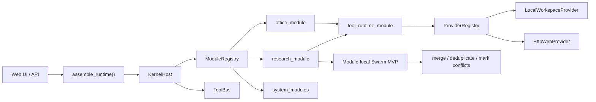

# Multi Agent Team (Agent OS)

[中文 README](README.md)

[](https://github.com/jonhncatt/Multi_Agent_Team/actions/workflows/regression-ci.yml)
[](requirements.txt)
[](https://fastapi.tiangolo.com/)
[](LICENSE)

Multi Agent Team is a local **Agent OS-style** system with a stable kernel, formal business modules, tool/provider contracts, quality gates, and operational runbooks.

## What It Is

- `KernelHost` stays small and stable: load, dispatch, isolate, health, rollback.
- `office_module` is a business module, not the platform core.
- `research_module` is the second formal module and the current non-office reference module.
- Swarm MVP is implemented as a bounded module-local orchestration flow, not a kernel rewrite.
- Quality is guarded through pytest, gate evals, smoke layers, replay samples, platform metrics, and release runbooks.

## Quick Start

```bash
git clone https://github.com/jonhncatt/Multi_Agent_Team.git
cd Multi_Agent_Team
python3 -m venv .venv
source .venv/bin/activate
pip install -r requirements.txt
cp .env.example .env
# edit .env and set one API key:
#   MULTI_AGENT_TEAM_PROVIDER_OPENAI_API_KEY=... (recommended)
#   or MULTI_AGENT_TEAM_LLM_API_KEY=...
#   or OPENAI_API_KEY=... (legacy compatibility)
./run.sh
```

Main app: <http://127.0.0.1:8080>

Role-agent lab: 

```bash
./run-role-agent-lab.sh
```

Lab app: <http://127.0.0.1:8081>

## Screenshots

### Main app (8080)


### Role-Agent Lab (8081)


## Demo Paths

- baseline smoke: `python scripts/demo_minimal_agent_os.py --check`
- research module demo: `python scripts/demo_research_module.py --check`
- research Swarm demo: `python scripts/demo_research_swarm.py --check`

## Execution Path Reality Check (April 2, 2026)

If you still see the old flow text, this is what is true in current code:

- `Frontend -> POST /api/chat`: true (`app/main.py`).
- `LLMRouter reads 12 agent manifest.json files`: partially true. `/api/chat` still follows `KernelHost.dispatch -> business_module` and does not execute all 12 plugins directly, but **Control Panel + `/api/agent-plugins`** are now manifest-driven via `app/agents/manifests/*.json` and `AgentPluginRuntime`.
- `LLM always generates shortest 1~4 steps`: false. `execution_plan` is runtime-generated and not constrained by a global 1~4-step contract.
- `Selected agent runs handle_task`: false. The business entrypoint is `handle/invoke` (`KernelHost.dispatch -> business_module.handle`), not a unified plugin `handle_task`.
- `Aggregate result and write session`: true (`session_store.append_turn(...)` + `session_store.save(...)` in `app/main.py`).

Current runtime path:

```text
HTTP / UI
  -> app/bootstrap/assemble.py
  -> KernelHost.dispatch(TaskRequest)
  -> business module handle
  -> ToolBus / ToolRegistry / ProviderRegistry
  -> response + trace + persisted session
```

Plugin runtime surface:

- `GET /api/agent-plugins`: returns 12 plugin descriptors + tool model (`tool_profile / allowed_tools / max_tool_rounds`).
- `POST /api/agent-plugins/run`: runs one plugin independently by `plugin_id` (router uses rule route; other plugins use restricted tool loops).

## Operations Entry

Start here if you want the current platform status, gate status, metrics summary, replay sample overview, and reporting template:

- [Platform Operations Overview](docs/operations/platform_operations_overview.md)
- [Platform Reporting Template](docs/operations/platform_reporting_template.md)
- [Quality Gates](docs/operations/quality_gates.md)
- [Smoke Matrix](docs/operations/smoke_matrix.md)

## Key Docs

- [Current Execution Path](docs/architecture/current_execution_path.md)
- [Platform Boundaries](docs/architecture/platform_boundaries.md)
- [Research Module](docs/modules/research_module.md)
- [Swarm Roadmap](docs/swarm-roadmap.md)
- [Swarm Demo Notes](docs/demo/research_swarm_demo.md)
- [Packages Boundary Guide](packages/README.md)

## Architecture Sketch



## Swarm and Tool Status

- Swarm is currently a formal capability inside `research_module` (parallel branch execution + join + serial replay degradation).
- `office_module` has internal role orchestration (`Router/Planner/Worker/Reviewer/Revision`), but this is module-internal, not kernel-level 12-plugin dispatch.
- Tool execution path is `KernelHost.dispatch -> business module -> tool_runtime_module -> ToolBus/ToolRegistry -> ProviderRegistry`.
- Providers are assembled in `app/bootstrap/assemble.py` (`local_workspace`, `local_file`, `http_web`, `patch_write`, optional `session_store`).
