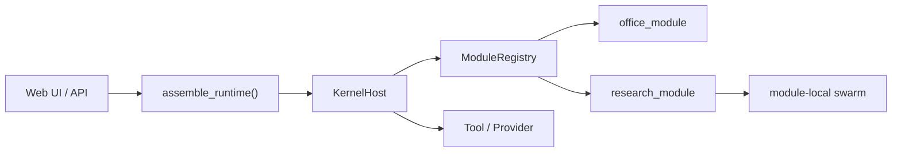

# Multi_Agent_Robot


[中文 README](README.md)

[](https://github.com/jonhncatt/Multi_Agent_Robot/actions/workflows/regression-ci.yml)
[](requirements.txt)
[](https://fastapi.tiangolo.com/)
[](LICENSE)

`Multi_Agent_Robot` is a local Agent OS-style system.

Think of it as a load-bearing hull: a stable base that can carry modules, tools, and workflows without turning the whole product into one oversized prompt.

It separates the platform into clear layers:

- kernel: `KernelHost`
- modules: business modules vs. system modules
- tools/providers: stable interfaces with replaceable implementations
- quality: `gate / smoke / replay / metrics`
- operations: Web UI, API, runbooks, and runtime views

## What You Get

- the main `Multi_Agent_Robot` interface
- the `Multi_Agent_Robot Lab` experimental interface
- formal module paths for `office_module` and `research_module`
- tool/provider-based local workspace and web execution
- demos, regression tests, and operational artifacts

## UI

### Multi_Agent_Robot


### Multi_Agent_Robot Lab


## Quick Start

Recommended environment: Python 3.11.

```bash
git clone https://github.com/jonhncatt/Multi_Agent_Robot.git
cd Multi_Agent_Robot
python3 -m venv .venv
source .venv/bin/activate
pip install -r requirements.txt
cp .env.example .env
./run.sh
```

Main UI: <http://127.0.0.1:8080>

Multi_Agent_Robot Lab:

```bash
./run-role-agent-lab.sh
```

Lab UI: <http://127.0.0.1:8081>

## Common Entry Points

- main product: `./run.sh` or `./run-multi-agent-robot.sh`
- lab deck: `./run-role-agent-lab.sh`
- legacy alias: `./run-kernel-robot.sh`
- minimal smoke: `python scripts/demo_minimal_agent_os.py --check`
- research module demo: `python scripts/demo_research_module.py --check`
- swarm demo: `python scripts/demo_research_swarm.py --check`

## Core Shape



## Where To Start

### Runtime assembly

- `app/bootstrap/assemble.py`
- `app/kernel/host.py`
- `app/product_profiles.py`

### Business modules

- `app/business_modules/office_module/module.py`
- `app/business_modules/research_module/module.py`
- `docs/modules/module_integration_guide.md`

### Execution and observability

- `docs/architecture/current_execution_path.md`
- `docs/observability/trace_guide.md`
- `docs/observability/troubleshooting.md`

### Platform boundaries

- `docs/architecture/platform_boundaries.md`
- `docs/architecture/swarm_contract.md`
- `docs/migration/compatibility_shim_inventory.md`

## Validation

```bash
pip install -r requirements-dev.txt
python scripts/demo_minimal_agent_os.py --check
pytest
```

## Project Layout

- `app/`: UI, API, kernel, runtime assembly
- `packages/`: shared runtime and package boundaries
- `scripts/`: demos and helper scripts
- `tests/`: regression coverage
- `docs/`: architecture, modules, operations, observability

## Related Docs

- Module integration: `docs/modules/module_integration_guide.md`
- Platform metrics: `docs/operations/platform_metrics.md`
- Milestones: `docs/roadmap/agent_os_milestones.md`
- Evolution direction (2026): `docs/roadmap/evolution_direction_2026.md`
- Swarm roadmap: `docs/swarm-roadmap.md`

## Notes

- the UI can start without `OPENAI_API_KEY`, but `/api/chat` will not work until auth is configured
- the app automatically reads the project root `.env`
- `kernel_robot` remains as a compatibility alias, but the public product name is now `Multi_Agent_Robot`
- long-form design and migration material lives under `docs/`
