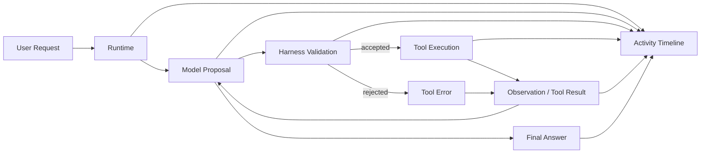

# Vintage Programmer


A local-first AI agent workbench with Codex-style activity tracing, editable agent specs, local skills, and harness-validated execution.

**Vintage Programmer** is built for people who want observable AI execution, not just a final answer.  
Instead of hiding the process, it exposes the loop:
**user request -> model proposal -> harness validation -> tool execution -> observation -> final answer**

[Chinese README](README.zh-CN.md) · [Japanese README](README.ja.md) · [English README](README.en.md) · [Windows Guide](README.windows.md) · [Release Flow](RELEASING.md) · [Internal Design Manual](docs/internal_design_manual.md)

Current stable release: `v2.7.4`

## What it is

Vintage Programmer is a local AI agent workstation centered on one default main agent: `vintage_programmer`.

It combines:

- a Chat Completions based runtime loop
- Codex-style activity and progress tracing
- harness-side tool validation and execution
- editable local agent specs written in Markdown
- local skills that can be enabled and injected into the main agent
- multilingual UI and documentation

This repository is not a thin chat wrapper. It is meant for building, debugging, and demonstrating an observable AI agent workflow.

## Why this project exists

Most AI chat tools optimize for the final answer.
Vintage Programmer optimizes for the execution path behind that answer.

It is designed for scenarios where you want to understand:

- what the model is trying to do
- which tool it wants to call
- whether the runtime accepts the action
- what result comes back
- how that result changes the next step
- how the final answer is produced

That makes the agent easier to inspect, trust, and improve.

## Highlights

- **Codex-style activity timeline**  
  Shows model progress, tool calls, validation state, and answer generation as a visible runtime trace.
- **Model-led, harness-validated execution**  
  The model proposes actions; the runtime validates tool names, arguments, and execution boundaries before running anything.
- **Editable agent specs**  
  The main agent behavior is defined by local Markdown files you can inspect and change directly.
- **Local skills system**  
  Workspace skills can be added, toggled, and bound to `vintage_programmer`.
- **Verified provider profiles**  
  `.env.example` and source code currently verify support for OpenAI, OpenAI-compatible gateways, OpenRouter, and local Ollama profiles.
- **Multilingual locale layer**  
  User-facing text is localized for `zh-CN`, `ja-JP`, and `en` without splitting the codebase.

## How it differs from a normal chat UI

A normal chat UI mainly shows the final answer.
Vintage Programmer also shows the execution path:

- model intent and action proposal
- harness validation
- tool call arguments
- tool results and observations
- progress checklist
- runtime statistics
- final answer

It is built for AI agent development, debugging, and demonstrations, not only for chat completion output.

## Runtime Flow



## Quick Start

### macOS / Linux

```bash
python3 -m venv .venv
source .venv/bin/activate
pip install -r requirements.txt
python3 -m playwright install chromium
cp .env.example .env
./run.sh
```

Open:

- <http://127.0.0.1:8080>

### Windows

See [README.windows.md](README.windows.md) for the Windows-first setup flow.

## Minimal Configuration

Copy `.env.example` to `.env`, then keep one provider profile enabled.

### OpenAI official

```env
VP_LLM_PROVIDER=openai
VP_OPENAI_API_KEY=your_key
VP_OPENAI_DEFAULT_MODEL=gpt-5.1-chat
```

### OpenAI official with Codex auth

```env
VP_LLM_PROVIDER=openai
VP_CODEX_HOME=/absolute/path/to/.codex
VP_CODEX_AUTH_FILE=/absolute/path/to/.codex/auth.json
VP_OPENAI_DEFAULT_MODEL=gpt-5.1-chat
```

If `VP_OPENAI_API_KEY` is absent but `VP_CODEX_AUTH_FILE` exists locally, the app can use Codex auth automatically.

### OpenAI-compatible gateway

```env
VP_LLM_PROVIDER=openai_compatible
VP_OPENAI_COMPAT_API_KEY=your_gateway_key
VP_OPENAI_COMPAT_BASE_URL=https://your-gateway.example.com/v1
VP_OPENAI_COMPAT_CA_CERT_PATH=/absolute/path/to/your-root-ca.pem
VP_OPENAI_COMPAT_DEFAULT_MODEL=gpt-5.1-chat
```

### OpenRouter

```env
VP_LLM_PROVIDER=openrouter
VP_OPENROUTER_API_KEY=your_openrouter_key
VP_OPENROUTER_BASE_URL=https://openrouter.ai/api/v1
VP_OPENROUTER_DEFAULT_MODEL=google/gemma-4-31b-it:free
VP_OPENROUTER_MODEL_FALLBACKS=nvidia/nemotron-3-super-120b-a12b:free
```

### Local Ollama

```env
VP_LLM_PROVIDER=ollama
VP_OLLAMA_BASE_URL=http://127.0.0.1:11434/v1
VP_OLLAMA_API_KEY=ollama
VP_OLLAMA_DEFAULT_MODEL=qwen2.5-coder:7b
```

For more options, see [.env.example](.env.example).

## API Note

These are this app's own local HTTP endpoints, not OpenAI official APIs:

- `GET /api/health`
- `GET /api/runtime-status`
- `POST /api/chat`
- `POST /api/chat/stream`
- `GET /api/workbench/tools`
- `GET /api/workbench/skills`
- `GET /api/workbench/specs`

The browser UI talks to these local app endpoints.

## Agent Specs

The default main agent is `vintage_programmer`.
Its core Markdown specs are:

- `agents/vintage_programmer/soul.md`
- `agents/vintage_programmer/identity.md`
- `agents/vintage_programmer/agent.md`
- `agents/vintage_programmer/tools.md`

Localized copies live under:

- `agents/vintage_programmer/locales/en/`
- `agents/vintage_programmer/locales/ja-JP/`

## Local Skills

Workspace skills live in:

```text
workspace/skills/<skill_id>/SKILL.md
```

Only skills with `enabled: true` and `bind_to` including `vintage_programmer` are injected into the main agent.

## Inline Code

If you paste code, XML, HTML, JSON, YAML, or other long text directly into the composer, the agent should analyze that inline content first instead of forcing a workspace path lookup.

## Locale Strategy

Supported locales:

- `zh-CN`
- `ja-JP`
- `en`

Effective initial locale priority:

```text
saved Settings selection
> server default locale (VP_DEFAULT_LOCALE)
> browser language
> ja-JP fallback
```

This keeps one code mainline while localizing user-facing UI and documentation through a locale layer.

## Documentation

- [README.md](README.md)
- [Chinese README](README.zh-CN.md)
- [Japanese README](README.ja.md)
- [English README](README.en.md)
- [Windows Guide](README.windows.md)
- [Release Flow](RELEASING.md)
- [Internal Design Manual](docs/internal_design_manual.md)

## Release

The formal release flow is:

1. Land release-candidate work on a `codex/*` branch.
2. Keep local runtime state out of Git.
3. Run the release gates locally.
4. Open a PR into `main`.
5. Merge to `main` only after the regression checks are green.
6. Create an annotated tag on the release commit.
7. Start the next change from a fresh `codex/*` branch cut from updated `main`.

See [RELEASING.md](RELEASING.md) for the full checklist.
