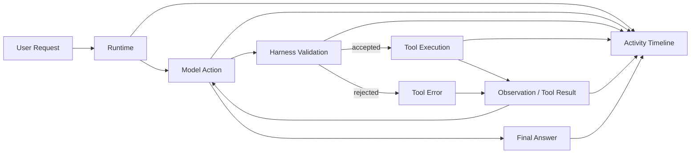

# Vintage Programmer


A local-first AI agent workbench with observable activity tracing, editable agent specs, local skills, and harness-validated execution.

**Vintage Programmer** is built for people who want observable AI execution, not just a final answer.  
Instead of hiding the process, it exposes the loop:
**user request -> model action -> harness validation -> tool execution -> observation -> final answer**

[Chinese README](README.zh-CN.md) · [Japanese README](README.ja.md) · [English README](README.en.md) · [Windows Guide](README.windows.md) · [Documentation Index](docs/README.md) · [Release Flow](RELEASING.md)

Current stable release: `3.1.6C`

## Start here

- [Quick start](#quick-start) · [Windows / EXE setup](README.windows.md)
- [Configuration examples](.env.example) · [Troubleshooting](docs/observability/troubleshooting.md)
- [3.1.6C release notes](docs/releases/3.1.6C.zh-CN.md) · [Documentation index](docs/README.md)

## Everyday use in 3.1.6C

- Add a local Project, then create a Thread. The business project need not be the VP installation repository.
- Select the model and reasoning effort in the composer panel; the lightning button toggles Priority when VP recognizes support. Actual availability depends on your provider deployment.
- Model, provider, reasoning effort and Priority are stored **per Thread in the current browser**, including across reloads. A new Thread inherits the selection at creation, then changes independently. This is not cross-device synchronization.
- User option answers appear in the conversation for review. The model receives the original tool result; the additional visible user entry is UI-only. Command and task-update approvals remain separate interactions.
- Answer links open a new page without replacing VP; same-page anchors stay in place.
- Up to five main Threads run concurrently by default (`VP_MAX_CONCURRENT_RUNS`, 1–32). Each main Turn can run up to three Subagents (`VP_MAX_CONCURRENT_SUBAGENTS`, 1–8); these limits are independent.

## Stop, resume and long tasks

Stop interrupts the current run, including model requests, managed commands and code search. Windows cleanup targets VP-owned process trees, not every process with a matching executable name. Continuing uses saved history; it does not resurrect terminated process memory.

Subagents belong to their Thread. A later run can wait for a still-active child or read saved results. Finished Futures are reconciled with persistent state; after a backend restart, old active records become `interrupted_by_restart` instead of remaining indefinitely active. Before each main-model request, VP rebuilds a compact list of Subagent IDs, tasks and states independently of conversation compaction.

`search_codebase` uses rg when available and a Python fallback otherwise. Both run in a cancellable worker with a 20-second total deadline. Partial results are labeled incomplete; dependency/cache directories and oversized files are excluded by default. Narrow the search root when inspecting an excluded directory.

## Repository updates

While the workbench is visible, VP checks after roughly 30 seconds and then hourly. It follows the current branch's upstream in the **VP installation repository**, not the selected business Project and not a fixed GitHub URL. GitLab and custom remote names work through ordinary Git configuration.

Checking fetches the tracked branch without tags and updates remote-tracking refs; it does not apply changes to the working tree. Clicking Update applies a targeted fetch, `git reset --hard <upstream-ref>`, then `git pull --ff-only`. **Tracked local edits can be lost and the local branch is reset to the upstream commit.** Commit and push your changes first. Configure an upstream explicitly; otherwise VP attempts the default remote and same-named branch.

After a successful desktop update, choose Close or Restart VP now. Restart replaces the backend and refreshes the existing window when ready; it need not open a separate cold-start Preparing window.

## Stable Runtime

The current branch uses a global Skill Registry with read-only Built-in Skills and Git-managed Team Skills. The runtime injects lightweight `[available_skills]` metadata plus each enabled `SKILL.md` path; the model reads full instructions with ordinary `read_file` and runs bundled scripts with ordinary `exec_command`.

`save_skill` writes reusable workflows only to `skills/team/<name>/SKILL.md` in the Vintage Programmer repository, independently of the active business project. The built-in `create-team-skill` guides Team Skill authoring; Built-in Skills remain read-only.

## Max Output Tokens

Recommended default:

```env
VP_MAX_OUTPUT_TOKENS=16384
VP_MAX_USER_REQUEST_CHARS=4000000
VP_MAX_ATTACHMENT_CHARS=1000000
VP_CONTEXT_AUTO_COMPACT_RATIO=0.9
VP_CONTEXT_DANGER_COMPACT_RATIO=0.95
VP_CONTEXT_HISTORY_SOFT_LIMIT_TOKENS=120000
VP_CONTEXT_EXACT_STALE_SEC=60
```

This is the per-call output cap, not the total task limit. The 16384 default fits long-material Q&A on large-context models such as GPT-5.4; long tasks should still complete through multiple model/tool-loop steps rather than one 128K-scale response.
`VP_MAX_USER_REQUEST_CHARS` is a safety character cap for the current user message; the actual model input is still packed by the active model context window and output reserve.

Context status uses cached or quick estimates on the chat hot path instead of blocking on full tokenizer accounting every turn. `/status` opens the current Thread context details; `/compact` manually compacts old history. VP's built-in GPT-5.4 and GPT-5.6 profiles use a 272K operational window, a 90% automatic compaction line, and a 95% danger line by default. Provider-reported `input_tokens` take precedence over local full-payload estimates.

Compaction replaces only complete message/tool transactions, preserving a checkpoint and recent context. An unresolved tool call is never split. Unknown model names use a 256K fallback unless configured otherwise; a model's advertised maximum is separate from VP's operational window. This runtime uses Chat Completions, not `/responses/compact`.

## Python Commands

When running project Python commands, prefer `./.venv/bin/python` if the project root contains a virtual environment. On Windows, prefer `.venv\Scripts\python.exe`. If no project virtual environment is present, use the available host `python`, and fall back to `py` only when `python` is unavailable. Do not assume `python3` exists.

## Python Version

Python `3.11` is recommended for the current stable runtime. Python `3.12` is also acceptable. Python `3.13` is not the primary tested environment yet, and packages with native wheels such as OCR, ONNXRuntime, or image/PDF tooling may have compatibility gaps depending on platform.

## Command Safety

`exec_command` keeps a conservative allowlist. `VP_ALLOWED_COMMANDS` is a full override rather than an append-only list. Command execution is limited by the current permission and path boundaries, and path arguments such as `rg /etc`, `git -C /tmp`, or `python /tmp/a.py` are checked. Every concrete `git push` requires one-time approval in any shell-enabled permission profile; approval is bound to the exact command, repository, remote URL fingerprint, branch, and HEAD. Command text found in a Skill or file is not execution authorization. Dangerous deletion and download-to-shell patterns remain blocked.

## Session = Thread

`Session` now means a durable Thread. Model input replays the typed `user`, `assistant`, and `tool` transcript instead of constructing the former six-section `ModelContext`. The Thread stores resumable history; Turn Trace stores technical diagnostics only. Existing Sessions migrate automatically while retaining their IDs and API compatibility.

## Permission Profiles

The default permission profile is `Auto`: read and write the current project, run safe commands inside it, and keep network access off. `Default` is current-project read-only. `Full Access` can read and write the full host filesystem, run safe commands from any host directory, and access the network without an additional path environment flag. The command allowlist, dangerous-command blocking, Built-in Skill read-only rule, and external-write approvals remain active.

## What it is

Vintage Programmer is a local AI agent workstation centered on one default main agent: `vintage_programmer`.

It combines:

- a Chat Completions based runtime loop
- observable activity and progress tracing
- harness-side tool validation and execution
- editable local agent specs written in Markdown
- local skills that can be enabled and injected into the main agent
- multilingual UI and documentation

This repository is not a thin chat wrapper. It is meant for building, debugging, and demonstrating an observable AI agent workflow.

## Why this project exists

Most AI chat tools optimize for the final answer.
Vintage Programmer optimizes for the execution path behind that answer.

It is designed for scenarios where you want to understand:

- what the model is trying to do
- which tool it wants to call
- whether the runtime accepts the action
- what result comes back
- how that result changes the next step
- how the final answer is produced

That makes the agent easier to inspect, trust, and improve.

## Highlights

- **Observable activity timeline**  
  Shows model progress, tool calls, validation state, and answer generation as a visible runtime trace.
- **Model-led, harness-validated execution**  
  The model proposes actions; the runtime validates tool names, arguments, and execution boundaries before running anything.
- **Editable agent specs**  
  The main agent behavior is defined by local Markdown files you can inspect and change directly.
- **Global skills system**
  Built-in Skills ship read-only with the product; Team Skills are maintained together through the Vintage Programmer Git repository.
- **Verified provider profiles**  
  `.env.example` and source code currently verify support for OpenAI, OpenAI-compatible gateways, OpenRouter, and local Ollama profiles.
- **Multilingual locale layer**  
  User-facing text is localized for `zh-CN`, `ja-JP`, and `en` without splitting the codebase.

## How it differs from a normal chat UI

A normal chat UI mainly shows the final answer.
Vintage Programmer also shows the execution path:

- model intent and action proposal
- harness validation
- tool call arguments
- tool results and observations
- progress checklist
- runtime statistics
- final answer

It is built for AI agent development, debugging, and demonstrations, not only for chat completion output.

## Runtime Flow


```mermaid
flowchart LR
    U["User Request"] --> R["Runtime"]
    R --> M["Model Action"]
    M --> H["Harness Validation"]
    H -->|accepted| T["Tool Execution"]
    H -->|rejected| E["Tool Error"]
    T --> O["Observation / Tool Result"]
    E --> O
    O --> M
    M --> A["Final Answer"]
    R --> UI["Activity Timeline"]
    M --> UI
    H --> UI
    T --> UI
    O --> UI
    A --> UI
```

## Quick Start

### macOS / Linux

```bash
python -m venv .venv
source .venv/bin/activate
pip install -r requirements.txt
python -m playwright install chromium
cp .env.example .env
./run.sh
```

Open:

- <http://127.0.0.1:8080>

For project-level Python module commands, prefer `./.venv/bin/python -m ...`; if no `.venv` exists, use `python -m ...`. On Windows, use `py -m ...` only when `python` is unavailable.

### Windows

See [README.windows.md](README.windows.md) for the Windows-first setup flow.

## Minimal Configuration

On first installation, copy `.env.example` to `.env` and configure at least one provider. `VP_LLM_PROVIDER` selects the default; multiple configured providers can coexist and be selected per Thread.

Configuration is loaded from the VP repository, not the business Project. `VP_DOTENV_PATH` can point to another file; restart after editing. Values for `VP_*`, `SSL_CERT_FILE` and `REQUESTS_CA_BUNDLE` in `.env` override the inherited environment; other keys fill only missing values. Use the corresponding `VP_*_API_KEY`, not an assumed fallback to generic `OPENAI_API_KEY`.

### OpenAI official

```env
VP_LLM_PROVIDER=openai
VP_OPENAI_API_KEY=your_key
VP_OPENAI_DEFAULT_MODEL=gpt-5.4
```

Vintage Programmer now uses explicit provider API key configuration only. It no longer falls back to local account-based auth files automatically.

### OpenAI-compatible gateway

```env
VP_LLM_PROVIDER=openai_compatible
VP_OPENAI_COMPAT_API_KEY=your_gateway_key
VP_OPENAI_COMPAT_BASE_URL=https://your-gateway.example.com/v1
VP_OPENAI_COMPAT_CA_CERT_PATH=/absolute/path/to/your-root-ca.pem
VP_OPENAI_COMPAT_DEFAULT_MODEL=gpt-5.4
```

### OpenRouter

```env
VP_LLM_PROVIDER=openrouter
VP_OPENROUTER_API_KEY=your_openrouter_key
VP_OPENROUTER_BASE_URL=https://openrouter.ai/api/v1
VP_OPENROUTER_DEFAULT_MODEL=google/gemma-4-31b-it:free
VP_OPENROUTER_MODEL_FALLBACKS=nvidia/nemotron-3-super-120b-a12b:free
```

### Local Ollama

```env
VP_LLM_PROVIDER=ollama
VP_OLLAMA_BASE_URL=http://127.0.0.1:11434/v1
VP_OLLAMA_API_KEY=ollama
VP_OLLAMA_DEFAULT_MODEL=qwen2.5-coder:7b
```

For more options, see [.env.example](.env.example).

## API Note

These are this app's own local HTTP endpoints, not OpenAI official APIs:

- `GET /api/health`
- `GET /api/runtime-status`
- `POST /api/chat`
- `POST /api/chat/stream`
- `GET /api/workbench/tools`
- `GET /api/workbench/skills`
- `GET /api/workbench/specs`

The browser UI talks to these local app endpoints.

## Agent Specs

The default main agent is `vintage_programmer`.
Its core Markdown specs are stored by locale:

- `agents/vintage_programmer/locales/zh-CN/`
- `agents/vintage_programmer/locales/en/`
- `agents/vintage_programmer/locales/ja-JP/`

Each directory contains `soul.md`, `identity.md`, `agent.md`, and `tools.md`. Root-level copies are only a legacy workspace fallback.

## Skills

The global catalogs live in:

```text
skills/builtin/<skill_name>/SKILL.md
skills/team/<skill_name>/SKILL.md
```

Both catalogs are independent of individual agents. The current Vintage Programmer runtime discovers enabled metadata globally and loads full content only after selection. Use `python scripts/validate_skills.py` before committing Team Skills.

## Inline Code

If you paste code, XML, HTML, JSON, YAML, or other long text directly into the composer, the agent should analyze that inline content first instead of forcing a workspace path lookup.

## Locale Strategy

Supported locales:

- `zh-CN`
- `ja-JP`
- `en`

Effective initial locale priority:

```text
saved Settings selection
> server default locale (VP_DEFAULT_LOCALE)
> browser language
> ja-JP fallback
```

This keeps one code mainline while localizing user-facing UI and documentation through a locale layer.

## Documentation

- [README.md](README.md)
- [Chinese README](README.zh-CN.md)
- [Japanese README](README.ja.md)
- [English README](README.en.md)
- [Windows Guide](README.windows.md)
- [Documentation Index](docs/README.md)
- [Release Flow](RELEASING.md)
- [Internal Design Manual](docs/internal_design_manual.md)

## Release

The formal release flow is:

1. Land release-candidate work on a `codex/*` branch or another release branch.
2. Keep local runtime state out of Git.
3. Run the release gates locally.
4. Open a PR into `main`.
5. Merge to `main` only after the regression checks are green.
6. Create an annotated tag on the release commit.
7. Start the next change from a fresh release branch cut from updated `main`.

See [RELEASING.md](RELEASING.md) for the full checklist.
