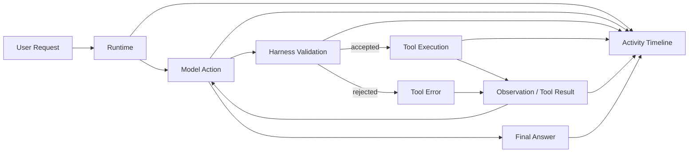

# Vintage Programmer


A local-first AI agent workbench with observable activity tracing, editable agent specs, local skills, and harness-validated execution.

**Vintage Programmer** is built for people who want observable AI execution, not just a final answer.  
Instead of hiding the process, it exposes the loop:
**user request -> model action -> harness validation -> tool execution -> observation -> final answer**

[Chinese README](README.zh-CN.md) · [Japanese README](README.ja.md) · [English README](README.en.md) · [Windows Guide](README.windows.md) · [Release Flow](RELEASING.md) · [Internal Design Manual](docs/internal_design_manual.md)

Current stable release: `3.1.5f`

## Stable Runtime

3.1.5f builds on the 3.1.5e delta-first task-state merge and closes the observability gap: run sidecars now persist `task_state`, `task_state_delta`, and `task_state_validation`, the Run/Debug panels expose the key checkpoint fields directly, and non-trivial execution turns that omit `task_state_delta` surface an explicit validation warning.

Compared with 3.1.5d, this release adds the `main.py` delta-first merge path, fallback regression coverage when no delta is present, and Run-panel visibility for `progress_basis` and `evidence_refs`.

## Max Output Tokens

Recommended default:

```env
VP_MAX_OUTPUT_TOKENS=4096
```

This is the per-call output cap, not the total task limit. Long tasks should complete through multiple model/tool-loop steps rather than one extremely large response.

## Python Commands

When running project Python commands, prefer `./.venv/bin/python` if the project root contains a virtual environment. On Windows, prefer `.venv\Scripts\python.exe`. If no project virtual environment is present, use the available host `python`, and fall back to `py` only when `python` is unavailable. Do not assume `python3` exists.

## Python Version

For the stable v2.9.x runtime, Python `3.11` is recommended. Python `3.12` is also acceptable. Python `3.13` is not the primary tested environment yet, and packages with native wheels such as OCR, ONNXRuntime, or image/PDF tooling may have compatibility gaps depending on platform.

## Command Safety

`exec_command` keeps a conservative allowlist. The recommended full safe list for v2.9.15 includes both `printf` and `dir`, and `VP_ALLOWED_COMMANDS` is a full override rather than an append-only list. Command execution is limited to the current project root by default, and path arguments such as `rg /etc`, `git -C /tmp`, or `python /tmp/a.py` are checked. High-risk commands such as `rm`, `chmod`, `chown`, `curl`, `wget`, `sudo`, `dd`, `kill`, `pkill`, `brew`, `pip`, and `pip3` remain blocked.

## ModelContext

In v2.9.15, the model prompt still renders only `ModelContext`, which has six explicit sections: `task`, `workspace`, `memory`, `plan`, `permissions`, and `conversation`. `RuntimeTrace`, raw tool output, model draft text, and legacy route/agent state are debug or migration inputs only, not normal model context.

## Permission Profiles

The default permission profile is `Code`: read the current project and imported files, write inside the current project, run safe commands inside the current project, and keep network access off by default. `Chat` is read-only analysis with no file writes or shell commands. `Full Dev` can read explicitly configured extra roots and can enable network according to global config, but it is still bounded by path checks, the command allowlist, and dangerous-command blocking.

## What it is

Vintage Programmer is a local AI agent workstation centered on one default main agent: `vintage_programmer`.

It combines:

- a Chat Completions based runtime loop
- observable activity and progress tracing
- harness-side tool validation and execution
- editable local agent specs written in Markdown
- local skills that can be enabled and injected into the main agent
- multilingual UI and documentation

This repository is not a thin chat wrapper. It is meant for building, debugging, and demonstrating an observable AI agent workflow.

## Why this project exists

Most AI chat tools optimize for the final answer.
Vintage Programmer optimizes for the execution path behind that answer.

It is designed for scenarios where you want to understand:

- what the model is trying to do
- which tool it wants to call
- whether the runtime accepts the action
- what result comes back
- how that result changes the next step
- how the final answer is produced

That makes the agent easier to inspect, trust, and improve.

## Highlights

- **Observable activity timeline**  
  Shows model progress, tool calls, validation state, and answer generation as a visible runtime trace.
- **Model-led, harness-validated execution**  
  The model proposes actions; the runtime validates tool names, arguments, and execution boundaries before running anything.
- **Editable agent specs**  
  The main agent behavior is defined by local Markdown files you can inspect and change directly.
- **Local skills system**  
  Workspace skills can be added, toggled, and bound to `vintage_programmer`.
- **Verified provider profiles**  
  `.env.example` and source code currently verify support for OpenAI, OpenAI-compatible gateways, OpenRouter, and local Ollama profiles.
- **Multilingual locale layer**  
  User-facing text is localized for `zh-CN`, `ja-JP`, and `en` without splitting the codebase.

## How it differs from a normal chat UI

A normal chat UI mainly shows the final answer.
Vintage Programmer also shows the execution path:

- model intent and action proposal
- harness validation
- tool call arguments
- tool results and observations
- progress checklist
- runtime statistics
- final answer

It is built for AI agent development, debugging, and demonstrations, not only for chat completion output.

## Runtime Flow


```mermaid
flowchart LR
    U["User Request"] --> R["Runtime"]
    R --> M["Model Action"]
    M --> H["Harness Validation"]
    H -->|accepted| T["Tool Execution"]
    H -->|rejected| E["Tool Error"]
    T --> O["Observation / Tool Result"]
    E --> O
    O --> M
    M --> A["Final Answer"]
    R --> UI["Activity Timeline"]
    M --> UI
    H --> UI
    T --> UI
    O --> UI
    A --> UI
```

## Quick Start

### macOS / Linux

```bash
python -m venv .venv
source .venv/bin/activate
pip install -r requirements.txt
python -m playwright install chromium
cp .env.example .env
./run.sh
```

Open:

- <http://127.0.0.1:8080>

For project-level Python module commands, prefer `./.venv/bin/python -m ...`; if no `.venv` exists, use `python -m ...`. On Windows, use `py -m ...` only when `python` is unavailable.

### Windows

See [README.windows.md](README.windows.md) for the Windows-first setup flow.

## Minimal Configuration

Copy `.env.example` to `.env`, then keep one provider profile enabled.

### OpenAI official

```env
VP_LLM_PROVIDER=openai
VP_OPENAI_API_KEY=your_key
VP_OPENAI_DEFAULT_MODEL=gpt-5.1-chat
```

Vintage Programmer now uses explicit provider API key configuration only. It no longer falls back to local account-based auth files automatically.

### OpenAI-compatible gateway

```env
VP_LLM_PROVIDER=openai_compatible
VP_OPENAI_COMPAT_API_KEY=your_gateway_key
VP_OPENAI_COMPAT_BASE_URL=https://your-gateway.example.com/v1
VP_OPENAI_COMPAT_CA_CERT_PATH=/absolute/path/to/your-root-ca.pem
VP_OPENAI_COMPAT_DEFAULT_MODEL=gpt-5.1-chat
```

### OpenRouter

```env
VP_LLM_PROVIDER=openrouter
VP_OPENROUTER_API_KEY=your_openrouter_key
VP_OPENROUTER_BASE_URL=https://openrouter.ai/api/v1
VP_OPENROUTER_DEFAULT_MODEL=google/gemma-4-31b-it:free
VP_OPENROUTER_MODEL_FALLBACKS=nvidia/nemotron-3-super-120b-a12b:free
```

### Local Ollama

```env
VP_LLM_PROVIDER=ollama
VP_OLLAMA_BASE_URL=http://127.0.0.1:11434/v1
VP_OLLAMA_API_KEY=ollama
VP_OLLAMA_DEFAULT_MODEL=qwen2.5-coder:7b
```

For more options, see [.env.example](.env.example).

## API Note

These are this app's own local HTTP endpoints, not OpenAI official APIs:

- `GET /api/health`
- `GET /api/runtime-status`
- `POST /api/chat`
- `POST /api/chat/stream`
- `GET /api/workbench/tools`
- `GET /api/workbench/skills`
- `GET /api/workbench/specs`

The browser UI talks to these local app endpoints.

## Agent Specs

The default main agent is `vintage_programmer`.
Its core Markdown specs are:

- `agents/vintage_programmer/soul.md`
- `agents/vintage_programmer/identity.md`
- `agents/vintage_programmer/agent.md`
- `agents/vintage_programmer/tools.md`

Localized copies live under:

- `agents/vintage_programmer/locales/en/`
- `agents/vintage_programmer/locales/ja-JP/`

## Local Skills

Workspace skills live in:

```text
workspace/skills/<skill_id>/SKILL.md
```

Only skills with `enabled: true` and `bind_to` including `vintage_programmer` are injected into the main agent.

## Inline Code

If you paste code, XML, HTML, JSON, YAML, or other long text directly into the composer, the agent should analyze that inline content first instead of forcing a workspace path lookup.

## Locale Strategy

Supported locales:

- `zh-CN`
- `ja-JP`
- `en`

Effective initial locale priority:

```text
saved Settings selection
> server default locale (VP_DEFAULT_LOCALE)
> browser language
> ja-JP fallback
```

This keeps one code mainline while localizing user-facing UI and documentation through a locale layer.

## Documentation

- [README.md](README.md)
- [Chinese README](README.zh-CN.md)
- [Japanese README](README.ja.md)
- [English README](README.en.md)
- [Windows Guide](README.windows.md)
- [Release Flow](RELEASING.md)
- [Internal Design Manual](docs/internal_design_manual.md)

## Release

The formal release flow is:

1. Land release-candidate work on a `cleanup/*` branch or another release branch.
2. Keep local runtime state out of Git.
3. Run the release gates locally.
4. Open a PR into `main`.
5. Merge to `main` only after the regression checks are green.
6. Create an annotated tag on the release commit.
7. Start the next change from a fresh release branch cut from updated `main`.

See [RELEASING.md](RELEASING.md) for the full checklist.
