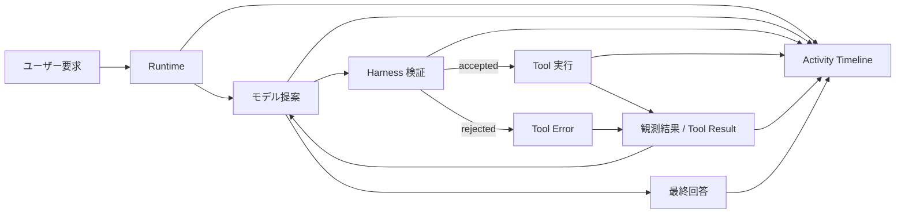

# Vintage Programmer


Codex 風の activity tracing を備えた、ローカルファーストの AI Agent ワークベンチです。editable agent specs と local skills、そして harness-validated execution を一体で扱えます。

**Vintage Programmer** は、最終回答だけを返す通常のチャット UI ではありません。  
1 回の turn の中で Agent が何を提案し、runtime が何を検証し、どの tool が実行され、どのような観測結果が返ったのかを見えるようにすることを目的としています。
**ユーザー要求 -> モデル提案 -> harness 検証 -> tool 実行 -> 観測結果 -> 最終回答**

[English README](README.md) · [中文 README](README.zh-CN.md) · [English Mirror](README.en.md) · [Windows Guide](README.windows.md) · [Release Flow](RELEASING.md) · [内部設計マニュアル](docs/internal_design_manual.md)

現在の安定版: `v2.7.4`

## これは何か

Vintage Programmer は、既定のメイン agent として `vintage_programmer` を持つローカル AI Agent ワークベンチです。

このリポジトリには、次の要素がまとまっています。

- Chat Completions ベースの runtime loop
- Codex 風の activity timeline と progress checklist
- harness 側の tool validation と execution
- Markdown で編集できるローカル agent specs
- メイン agent に bind できる local skills
- `zh-CN`、`ja-JP`、`en` の多言語 UI / ドキュメント

単なるチャットラッパーではなく、AI Agent の開発・観測・デバッグに寄せたローカル作業環境です。

## なぜ作るのか

多くの AI チャット製品は最終回答を重視します。
Vintage Programmer は、その回答に至る execution path を重視します。

次のようなことを確認したい場面向けです。

- モデルが今何をしようとしているか
- どの tool を呼ぼうとしているか
- runtime がその action を許可するか
- tool から何が返ってきたか
- その観測結果が次の判断をどう変えるか
- 最終回答がどう組み立てられたか

そのため、agent の挙動を理解しやすく、改善もしやすくなります。

## 主な特徴

- **Codex 風 activity timeline**  
  モデルの進行、tool call、validation 状態、回答生成を可視化します。
- **モデル主導、harness 検証実行**  
  action proposal はモデルが行い、tool 名・引数・実行境界の検証は runtime が担当します。
- **編集可能な Agent Specs**  
  メイン agent の振る舞いはローカルの Markdown spec で定義されています。
- **Local Skills システム**  
  workspace に skill を追加し、ON/OFF や bind を管理できます。
- **検証済み provider profiles**  
  `.env.example` とソースコード上、OpenAI、OpenAI-compatible gateway、OpenRouter、ローカル Ollama を確認できます。
- **多言語 locale layer**  
  UI とドキュメントは `zh-CN`、`ja-JP`、`en` をサポートします。

## 通常の Chat UI との違い

通常の Chat UI は、主に最終回答だけを見せます。
Vintage Programmer は、その途中の execution path も見せます。

たとえば次の情報を追えます。

- モデルの意図と action proposal
- harness validation
- tool call arguments
- tool result と observation
- progress checklist
- runtime statistics
- final answer

そのため、AI Agent の開発、デバッグ、デモに向いています。

## Runtime Flow



## クイックスタート

### macOS / Linux

```bash
python3 -m venv .venv
source .venv/bin/activate
pip install -r requirements.txt
python3 -m playwright install chromium
cp .env.example .env
./run.sh
```

起動先:

- <http://127.0.0.1:8080>

### Windows

Windows 向けの推奨手順は [README.windows.md](README.windows.md) を参照してください。

## `.env` の最小設定

`.env.example` を `.env` にコピーし、1 つの provider profile だけを有効にしてください。

### OpenAI 公式

```env
VP_LLM_PROVIDER=openai
VP_OPENAI_API_KEY=your_key
VP_OPENAI_DEFAULT_MODEL=gpt-5.1-chat
```

### OpenAI 公式 + Codex auth

```env
VP_LLM_PROVIDER=openai
VP_CODEX_HOME=/absolute/path/to/.codex
VP_CODEX_AUTH_FILE=/absolute/path/to/.codex/auth.json
VP_OPENAI_DEFAULT_MODEL=gpt-5.1-chat
```

`VP_OPENAI_API_KEY` がなくても、ローカルに `VP_CODEX_AUTH_FILE` があれば Codex auth を自動利用できます。

### OpenAI-compatible gateway

```env
VP_LLM_PROVIDER=openai_compatible
VP_OPENAI_COMPAT_API_KEY=your_gateway_key
VP_OPENAI_COMPAT_BASE_URL=https://your-gateway.example.com/v1
VP_OPENAI_COMPAT_CA_CERT_PATH=/absolute/path/to/your-root-ca.pem
VP_OPENAI_COMPAT_DEFAULT_MODEL=gpt-5.1-chat
```

### OpenRouter

```env
VP_LLM_PROVIDER=openrouter
VP_OPENROUTER_API_KEY=your_openrouter_key
VP_OPENROUTER_BASE_URL=https://openrouter.ai/api/v1
VP_OPENROUTER_DEFAULT_MODEL=google/gemma-4-31b-it:free
VP_OPENROUTER_MODEL_FALLBACKS=nvidia/nemotron-3-super-120b-a12b:free
```

### ローカル Ollama

```env
VP_LLM_PROVIDER=ollama
VP_OLLAMA_BASE_URL=http://127.0.0.1:11434/v1
VP_OLLAMA_API_KEY=ollama
VP_OLLAMA_DEFAULT_MODEL=qwen2.5-coder:7b
```

その他のオプションは [.env.example](.env.example) を参照してください。

## API Note

以下は OpenAI 公式 API ではなく、このアプリ自身のローカル HTTP エンドポイントです。

- `GET /api/health`
- `GET /api/runtime-status`
- `POST /api/chat`
- `POST /api/chat/stream`
- `GET /api/workbench/tools`
- `GET /api/workbench/skills`
- `GET /api/workbench/specs`

ブラウザ UI はこれらのローカル API を利用します。

## Agent Specs

既定のメイン agent は `vintage_programmer` です。
コアとなる Markdown spec は次の 4 つです。

- `agents/vintage_programmer/soul.md`
- `agents/vintage_programmer/identity.md`
- `agents/vintage_programmer/agent.md`
- `agents/vintage_programmer/tools.md`

ローカライズ版:

- `agents/vintage_programmer/locales/en/`
- `agents/vintage_programmer/locales/ja-JP/`

## Local Skills

workspace skill は次に配置します。

```text
workspace/skills/<skill_id>/SKILL.md
```

`enabled: true` かつ `bind_to` に `vintage_programmer` を含む skill だけがメイン agent に注入されます。

## Inline Code

コード、XML、HTML、JSON、YAML、または長いテキストを composer に直接貼り付けた場合、agent はまずその inline content を解析し、先に workspace path を要求しない設計です。

## 多言語方針

現在サポートする locale:

- `zh-CN`
- `ja-JP`
- `en`

初期 locale の優先順位は、現在のソース実装では次の通りです。

```text
保存済みの Settings 選択
> サーバー既定 locale（VP_DEFAULT_LOCALE）
> ブラウザ言語
> ja-JP fallback
```

これにより、コードの mainline は 1 つのまま、ユーザー向け文言だけを locale layer で切り替えられます。

## ドキュメント

- [README.md](README.md)
- [中文 README](README.zh-CN.md)
- [English README](README.en.md)
- [Windows Guide](README.windows.md)
- [Release Flow](RELEASING.md)
- [内部設計マニュアル](docs/internal_design_manual.md)

## Release

正式な release flow は次の通りです。

1. `codex/*` ブランチで release candidate の変更を進める。
2. ローカル runtime state を Git に含めない。
3. ローカルで release gates を実行する。
4. `main` への PR を作成する。
5. 回帰確認が green になってから `main` へマージする。
6. release commit に annotated tag を作成する。
7. 次の作業は、更新済み `main` から新しい `codex/*` ブランチを切って始める。

詳細は [RELEASING.md](RELEASING.md) を参照してください。
