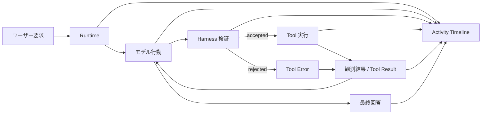

# Vintage Programmer


可観測な activity tracing を備えた、ローカルファーストの AI Agent ワークベンチです。editable agent specs と local skills、そして harness-validated execution を一体で扱えます。

**Vintage Programmer** は、最終回答だけを返す通常のチャット UI ではありません。  
1 回の turn の中で Agent が何を提案し、runtime が何を検証し、どの tool が実行され、どのような観測結果が返ったのかを見えるようにすることを目的としています。
**ユーザー要求 -> モデル行動 -> harness 検証 -> tool 実行 -> 観測結果 -> 最終回答**

[中文ホーム](README.md) · [中文 README](README.zh-CN.md) · [English README](README.en.md) · [Windows Guide](README.windows.md) · [ドキュメント索引](docs/README.md) · [Release Flow](RELEASING.md)

現在の安定版: `3.1.6C`

## はじめに

- [Windows / EXE 導入](README.windows.md) · [設定例](.env.example)
- [トラブルシューティング](docs/observability/troubleshooting.md) · [ドキュメント一覧](docs/README.md)
- [3.1.6C リリースノート](docs/releases/3.1.6C.zh-CN.md)

## 3.1.6C の日常操作

- ローカルの Project を追加してから Thread を作成します。業務 Project と VP のインストール用リポジトリは別でも構いません。
- 入力欄のパネルでモデルと推論強度を選択し、稲妻ボタンで対応モデルの Priority を切り替えます。実際に使える機能は接続先のデプロイに依存します。
- モデル、provider、推論強度、Priority は **現在のブラウザ内で Thread ごとに保存**され、再読み込み後も復元されます。新規 Thread は作成時の設定を引き継ぎ、その後は独立します。別 PC・別ブラウザとの同期ではありません。
- 選択肢への回答は会話にも表示されます。モデルへは元の ToolMessage として渡し、表示用の user 記録は再送しません。コマンド承認・タスク更新承認とは別の操作です。
- 回答内の通常リンクは別ページで開き、VP の画面を置き換えません。ページ内アンカーはそのまま利用できます。
- メイン Thread の同時実行数は既定で 5（`VP_MAX_CONCURRENT_RUNS`: 1–32）、各メイン Turn の Subagent は既定で 3（`VP_MAX_CONCURRENT_SUBAGENTS`: 1–8）です。二つの上限は独立しています。

## 停止・再開・長いタスク

停止は現在のモデル要求、管理対象コマンド、コード検索を中断します。Windows では VP が管理する実行の子プロセスツリーだけを終了し、同名の別アプリを一括終了しません。「続けて」は保存済み履歴からの再開であり、終了したプロセスのメモリを復元する操作ではありません。

Subagent は Thread 単位で管理します。次の実行でも動作中の ID を待機でき、完了済みなら保存した結果を取得できます。Future の終了状態を照合し、バックエンド再起動後の古い活動中タスクは `interrupted_by_restart` にします。メインモデルの要求前には Subagent の ID・タスク・状態を再構築するため、圧縮で元の spawn メッセージがなくなっても参照できます。

`search_codebase` は rg があれば使用し、なければ Python にフォールバックします。どちらも停止可能な独立 worker で動き、検索全体の期限は 20 秒です。途中結果は不完全と明示します。依存・キャッシュディレクトリや巨大ファイルは既定で除外し、必要な場合は検索ルートを絞ります。

## リポジトリ更新

画面の読み込み後約 30 秒、その後は 1 時間ごとに更新を確認します。非表示中は省略します。対象は **VP インストール用リポジトリの現在の branch / upstream** であり、業務 Project や固定の GitHub URL ではありません。GitLab や独自 remote 名にも Git の設定で対応します。

確認時は tags を含めず対象 branch を fetch し、remote-tracking ref を更新するだけです。更新ボタンを押すと fetch → `git reset --hard <upstream-ref>` → `git pull --ff-only` を実行します。**追跡済みファイルの未コミット変更は失われ、ローカル branch は upstream に戻ります。** 自分の変更は先に commit・push してください。upstream 未設定時は既定 remote と同名 branch を試すため、明示的な追跡設定を推奨します。

EXE では更新後に閉じるか即時再起動を選べます。再起動は既存ウィンドウで待機し、新しいバックエンドの準備後に再読み込みします。毎回別の Preparing ウィンドウが開くわけではありません。

## Stable Runtime

現在の branch は、読み取り専用の Built-in Skills と Git で共同管理する Team Skills を持つグローバル Skill Registry を使用します。runtime は軽量な `[available_skills]` metadata と有効な各 `SKILL.md` のパスを渡し、モデルは通常の `read_file` で完全な説明を読み、通常の `exec_command` で同梱スクリプトを実行します。

`save_skill` は再利用可能な手順を Vintage Programmer repository の `skills/team/<name>/SKILL.md` にだけ保存し、現在選択中の業務 project には書き込みません。Built-in の `create-team-skill` が Team Skill 作成を案内し、Built-in Skills 自体は読み取り専用です。

## Max Output Tokens

推奨デフォルト:

```env
VP_MAX_OUTPUT_TOKENS=16384
VP_MAX_USER_REQUEST_CHARS=4000000
VP_MAX_ATTACHMENT_CHARS=1000000
VP_CONTEXT_AUTO_COMPACT_RATIO=0.9
VP_CONTEXT_DANGER_COMPACT_RATIO=0.95
VP_CONTEXT_HISTORY_SOFT_LIMIT_TOKENS=120000
VP_CONTEXT_EXACT_STALE_SEC=60
```

これは 1 回のモデル呼び出しごとの出力上限であり、タスク全体の上限ではありません。16384 のデフォルトは GPT-5.4 のような大きな context window を持つモデルでの長文資料 Q&A に向いていますが、長いタスクは 128K 級の巨大な単発応答ではなく、複数回の model/tool loop で進めます。
`VP_MAX_USER_REQUEST_CHARS` は現在のユーザー入力に対する安全用の文字数上限です。実際にモデルへ入る内容は、現在のモデルの context window と出力予約分に基づく token budget でさらに調整されます。

Context 状態は cached/quick 見積もりを使い、チャットの通常経路を full tokenizer 計算でブロックしません。`/status` は現在の Thread の context 詳細を表示し、`/compact` は古い履歴を手動で整理します。VP 内蔵の GPT-5.4 / GPT-5.6 プロファイルは既定で 272K の運用 window、90% の自動整理ライン、95% の危険ラインを使用し、provider の実測 `input_tokens` をローカル推定より優先します。

圧縮は完結したメッセージ・ツール取引単位で行い、checkpoint と最近の内容を残します。未完結の tool call は分割しません。未知のモデル名は設定がなければ 256K にフォールバックします。モデル最大値と VP の運用 window は別です。現在の Runtime は Chat Completions を使い、`/responses/compact` は呼びません。

## Python Commands

プロジェクトの Python コマンドを実行するときは、プロジェクトルートに仮想環境があれば `./.venv/bin/python` を優先してください。Windows では `.venv\Scripts\python.exe` を優先します。仮想環境がない場合のみ、利用可能なホスト `python` を使い、`python` が使えない場合だけ `py` に退避します。`python3` が必ずあるとは仮定しません。

## Python Version

現在の安定 runtime では Python `3.11` を推奨します。Python `3.12` も利用可能です。Python `3.13` はまだ主要なテスト対象ではなく、OCR、ONNXRuntime、画像/PDF 処理など native wheel に依存するパッケージで環境差が出る可能性があります。

## Command Safety

`exec_command` は引き続き保守的な allowlist を使い、`VP_ALLOWED_COMMANDS` は追記ではなく完全上書きです。コマンド実行は現在の権限と path 境界に従い、`rg /etc`、`git -C /tmp`、`python /tmp/a.py` のような path 引数も検査されます。具体的な `git push` は shell を許可するすべての権限プロファイルで毎回一度限りの承認が必要で、承認は正確なコマンド、repository、remote URL fingerprint、branch、HEAD に結び付けられます。Skill やファイル内のコマンド文字列は実行権限ではなく、危険な削除や download-to-shell は引き続きブロックされます。

## Session = Thread

`Session` は現在、永続化された Thread を意味します。モデル入力は旧 6 セクションの `ModelContext` を構築せず、typed `user`、`assistant`、`tool` transcript を再生します。Thread は継続可能な履歴を保存し、Turn Trace は技術診断だけを保存します。既存 Session は ID と API 互換性を維持したまま自動移行されます。

## Permission Profiles

既定の permission profile は `Auto` です。現在の Project を読み書きし、その中で安全なコマンドを実行できます。network は off です。`Default` は現在の Project の読み取り専用です。`Full Access` は追加の path 環境変数なしでホストのファイルシステム全体を読み書きし、任意のホストディレクトリで安全なコマンドを実行し、network を利用できます。command allowlist、危険コマンドブロック、Builtin Skill の読み取り専用規則、外部書き込み承認は維持されます。

## これは何か

Vintage Programmer は、既定のメイン agent として `vintage_programmer` を持つローカル AI Agent ワークベンチです。

このリポジトリには、次の要素がまとまっています。

- Chat Completions ベースの runtime loop
- 可観測な activity timeline と progress checklist
- harness 側の tool validation と execution
- Markdown で編集できるローカル agent specs
- メイン agent に bind できる local skills
- `zh-CN`、`ja-JP`、`en` の多言語 UI / ドキュメント

単なるチャットラッパーではなく、AI Agent の開発・観測・デバッグに寄せたローカル作業環境です。

## なぜ作るのか

多くの AI チャット製品は最終回答を重視します。
Vintage Programmer は、その回答に至る execution path を重視します。

次のようなことを確認したい場面向けです。

- モデルが今何をしようとしているか
- どの tool を呼ぼうとしているか
- runtime がその action を許可するか
- tool から何が返ってきたか
- その観測結果が次の判断をどう変えるか
- 最終回答がどう組み立てられたか

そのため、agent の挙動を理解しやすく、改善もしやすくなります。

## 主な特徴

- **可観測な activity timeline**  
  モデルの進行、tool call、validation 状態、回答生成を可視化します。
- **モデル主導、harness 検証実行**  
  action proposal はモデルが行い、tool 名・引数・実行境界の検証は runtime が担当します。
- **編集可能な Agent Specs**  
  メイン agent の振る舞いはローカルの Markdown spec で定義されています。
- **Local Skills システム**  
  workspace に skill を追加し、ON/OFF や bind を管理できます。
- **検証済み provider profiles**  
  `.env.example` とソースコード上、OpenAI、OpenAI-compatible gateway、OpenRouter、ローカル Ollama を確認できます。
- **多言語 locale layer**  
  UI とドキュメントは `zh-CN`、`ja-JP`、`en` をサポートします。

## 通常の Chat UI との違い

通常の Chat UI は、主に最終回答だけを見せます。
Vintage Programmer は、その途中の execution path も見せます。

たとえば次の情報を追えます。

- モデルの意図と action proposal
- harness validation
- tool call arguments
- tool result と observation
- progress checklist
- runtime statistics
- final answer

そのため、AI Agent の開発、デバッグ、デモに向いています。

## Runtime Flow


```mermaid
flowchart LR
    U["ユーザー要求"] --> R["Runtime"]
    R --> M["モデル行動"]
    M --> H["Harness 検証"]
    H -->|accepted| T["Tool 実行"]
    H -->|rejected| E["Tool Error"]
    T --> O["観測結果 / Tool Result"]
    E --> O
    O --> M
    M --> A["最終回答"]
    R --> UI["Activity Timeline"]
    M --> UI
    H --> UI
    T --> UI
    O --> UI
    A --> UI
```

## クイックスタート

### macOS / Linux

```bash
python -m venv .venv
source .venv/bin/activate
pip install -r requirements.txt
python -m playwright install chromium
cp .env.example .env
./run.sh
```

起動先:

- <http://127.0.0.1:8080>

プロジェクト単位の Python モジュール実行は、まず `./.venv/bin/python -m ...` を優先し、`.venv` がない場合に `python -m ...` を使ってください。Windows で `python` が使えない場合のみ `py -m ...` を検討してください。

### Windows

Windows 向けの推奨手順は [README.windows.md](README.windows.md) を参照してください。

## `.env` の最小設定

初回導入時に `.env.example` を `.env` にコピーし、少なくとも一つの provider を設定してください。`VP_LLM_PROVIDER` は既定の接続先です。複数の provider を設定して Thread ごとに選択することもできます。

設定は業務 Project ではなく VP リポジトリから読み込みます。別ファイルは `VP_DOTENV_PATH` で指定し、変更後は再起動してください。`.env` の `VP_*`、`SSL_CERT_FILE`、`REQUESTS_CA_BUNDLE` は同名の環境変数を上書きし、それ以外は未設定時のみ補います。認証には対応する `VP_*_API_KEY` を使用し、一般的な `OPENAI_API_KEY` への自動フォールバックを前提にしないでください。

### OpenAI 公式

```env
VP_LLM_PROVIDER=openai
VP_OPENAI_API_KEY=your_key
VP_OPENAI_DEFAULT_MODEL=gpt-5.4
```

Vintage Programmer は明示的な provider API key 設定のみを使います。ローカルのアカウント認証ファイルへの自動フォールバックは行いません。

### OpenAI-compatible gateway

```env
VP_LLM_PROVIDER=openai_compatible
VP_OPENAI_COMPAT_API_KEY=your_gateway_key
VP_OPENAI_COMPAT_BASE_URL=https://your-gateway.example.com/v1
VP_OPENAI_COMPAT_CA_CERT_PATH=/absolute/path/to/your-root-ca.pem
VP_OPENAI_COMPAT_DEFAULT_MODEL=gpt-5.4
```

### OpenRouter

```env
VP_LLM_PROVIDER=openrouter
VP_OPENROUTER_API_KEY=your_openrouter_key
VP_OPENROUTER_BASE_URL=https://openrouter.ai/api/v1
VP_OPENROUTER_DEFAULT_MODEL=google/gemma-4-31b-it:free
VP_OPENROUTER_MODEL_FALLBACKS=nvidia/nemotron-3-super-120b-a12b:free
```

### ローカル Ollama

```env
VP_LLM_PROVIDER=ollama
VP_OLLAMA_BASE_URL=http://127.0.0.1:11434/v1
VP_OLLAMA_API_KEY=ollama
VP_OLLAMA_DEFAULT_MODEL=qwen2.5-coder:7b
```

その他のオプションは [.env.example](.env.example) を参照してください。

## API Note

以下は OpenAI 公式 API ではなく、このアプリ自身のローカル HTTP エンドポイントです。

- `GET /api/health`
- `GET /api/runtime-status`
- `POST /api/chat`
- `POST /api/chat/stream`
- `GET /api/workbench/tools`
- `GET /api/workbench/skills`
- `GET /api/workbench/specs`

ブラウザ UI はこれらのローカル API を利用します。

## Agent Specs

既定のメイン agent は `vintage_programmer` です。
コアとなる Markdown spec は locale ごとに配置されています。

- `agents/vintage_programmer/locales/zh-CN/`
- `agents/vintage_programmer/locales/en/`
- `agents/vintage_programmer/locales/ja-JP/`

各ディレクトリには `soul.md`、`identity.md`、`agent.md`、`tools.md` が含まれます。root-level の同名ファイルは旧 workspace 向け fallback です。

## Skills

グローバル catalog は次に配置します。

```text
skills/builtin/<skill_name>/SKILL.md
skills/team/<skill_name>/SKILL.md
```

両 catalog は特定の Agent に紐付きません。現在は Vintage Programmer が有効な metadata を発見し、選択後にだけ本文を読み込みます。Team Skill を commit する前に `python scripts/validate_skills.py` を実行してください。

## Inline Code

コード、XML、HTML、JSON、YAML、または長いテキストを composer に直接貼り付けた場合、agent はまずその inline content を解析し、先に workspace path を要求しない設計です。

## 多言語方針

現在サポートする locale:

- `zh-CN`
- `ja-JP`
- `en`

初期 locale の優先順位は、現在のソース実装では次の通りです。

```text
保存済みの Settings 選択
> サーバー既定 locale（VP_DEFAULT_LOCALE）
> ブラウザ言語
> ja-JP fallback
```

これにより、コードの mainline は 1 つのまま、ユーザー向け文言だけを locale layer で切り替えられます。

## ドキュメント

- [README.md](README.md)
- [中文 README](README.zh-CN.md)
- [English README](README.en.md)
- [Windows Guide](README.windows.md)
- [ドキュメント索引](docs/README.md)
- [Release Flow](RELEASING.md)
- [内部設計マニュアル](docs/internal_design_manual.md)

## Release

正式な release flow は次の通りです。

1. `codex/*` などの release candidate ブランチで変更を進める。
2. ローカル runtime state を Git に含めない。
3. ローカルで release gates を実行する。
4. `main` への PR を作成する。
5. 回帰確認が green になってから `main` へマージする。
6. release commit に annotated tag を作成する。
7. 次の作業は、更新済み `main` から新しい候補ブランチを切って始める。

詳細は [RELEASING.md](RELEASING.md) を参照してください。
