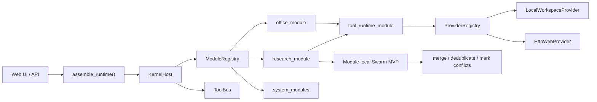

# Multi Agent Team (Agent OS)

[English README](README.en.md)

[](https://github.com/jonhncatt/Multi_Agent_Team/actions/workflows/regression-ci.yml)
[](requirements.txt)
[](https://fastapi.tiangolo.com/)
[](LICENSE)

这是一个 **Agent OS 风格** 的本地 Agent 系统。它的核心目标不是“做一个更大的 prompt”，而是把内核、模块、工具、Provider、质量门禁和运营层拆清楚，形成可维护的本地 Agent 平台。

当前项目已经具备：

- 稳定的 `KernelHost` 内核与模块装配边界
- `office_module` 与 `research_module` 两条正式业务主线
- 模块内 `Swarm MVP` 的业务可读输出
- `gate / smoke / replay / metrics / runbook` 的基础运营闭环

## 界面截图

### 主产品入口（8080）


### 运行时实验入口（8081）


## 架构速览



## 目录

- [1. 快速启动](#1-快速启动)
- [第一次使用：先跑哪个入口](#第一次使用先跑哪个入口)
- [开发模块：先看哪里](#开发模块先看哪里)
- [调试运行时：先看哪里](#调试运行时先看哪里)
- [最小演示路径](#最小演示路径)
- [质量门禁](#质量门禁)
- [2. 功能说明](#2-功能说明)
- [3. 目录结构](#3-目录结构)
- [架构关系](#架构关系)
- [4. 办公场景建议](#4-办公场景建议)
- [5. 注意事项](#5-注意事项)
- [Swarm Roadmap](docs/swarm-roadmap.md)

## 1. 快速启动

环境：macOS / Linux / Windows（推荐 Python 3.11）。

```bash
cd /Users/<YOU>/Desktop
git clone https://github.com/jonhncatt/Multi_Agent_Team.git
cd Multi_Agent_Team
python3 -m venv .venv
source .venv/bin/activate
pip install -r requirements.txt
cp .env.example .env
# 编辑 .env，至少配置以下之一：
#   MULTI_AGENT_TEAM_PROVIDER_OPENAI_API_KEY=...
#   MULTI_AGENT_TEAM_LLM_API_KEY=...
#   OPENAI_API_KEY=... (通用兼容)
# 如需接公司网关，再填 MULTI_AGENT_TEAM_LLM_BASE_URL=https://<YOUR_COMPANY_API_BASE>/v1
# 如需内部根证书，再填 MULTI_AGENT_TEAM_LLM_CA_CERT_PATH=/absolute/path/to/your-root-ca.cer
./run.sh
```

打开浏览器：<http://127.0.0.1:8080>

如需实验运行时视图，也可以单独启动：

```bash
./run-role-agent-lab.sh
```

实验台地址：<http://127.0.0.1:8081>

- 应用会自动读取项目根目录 `.env`，无需再手动 `export` 或 `setx`
- 未配置可用 API key 也会启动并监听端口，但 `/api/chat` 会报错直到配置好 key

### Windows 启动（PowerShell）

```powershell
cd $HOME\Desktop
git clone https://github.com/jonhncatt/Multi_Agent_Team.git
cd .\Multi_Agent_Team

py -3.11 -m venv .venv
.\.venv\Scripts\python.exe -m pip install --upgrade pip
.\.venv\Scripts\python.exe -m pip install -r requirements.txt
Copy-Item .env.example .env
# 编辑 .env（填 provider API key；需要的话再填公司网关和 CA）

.\run.ps1
```

### Windows 启动（CMD）

```bat
cd %USERPROFILE%\Desktop
git clone https://github.com/jonhncatt/Multi_Agent_Team.git
cd Multi_Agent_Team

py -3.11 -m venv .venv
.venv\Scripts\python.exe -m pip install --upgrade pip
.venv\Scripts\python.exe -m pip install -r requirements.txt
copy .env.example .env
rem 编辑 .env（填 provider API key；需要的话再填公司网关和 CA）

powershell -ExecutionPolicy Bypass -File .\run.ps1
```

### Windows 日常启动（后续每次）

首次配置完成后，后续每天只需要下面几步：

```powershell
cd $HOME\Desktop\Multi_Agent_Team
git pull
.\run.ps1
```

### 第一次使用：先跑哪个入口

- 日常产品入口：`./run.sh` 或 `.\run.ps1`
  - 地址：<http://127.0.0.1:8080>
  - 适合第一次体验完整产品链路
- 运行时实验入口：`./run-role-agent-lab.sh`
  - 地址：<http://127.0.0.1:8081>
  - 适合看 role 视图和实验态编排
- 最小无模型 smoke：`python scripts/demo_minimal_agent_os.py --check`
  - 适合先确认 `KernelHost -> office_module -> Tool/Provider` 是否通

### 开发模块：先看哪里

- 正式装配入口：[`app/bootstrap/assemble.py`](app/bootstrap/assemble.py)
- 正式内核入口：[`app/kernel/host.py`](app/kernel/host.py)
- 标准业务模块样板：[`app/business_modules/office_module/module.py`](app/business_modules/office_module/module.py)
- 第二正式模块候选：[`app/business_modules/research_module/module.py`](app/business_modules/research_module/module.py)
- `research_module` 说明：[docs/modules/research_module.md](docs/modules/research_module.md)
- 模块接入指南：[docs/modules/module_integration_guide.md](docs/modules/module_integration_guide.md)
- 平台边界规则：[docs/architecture/platform_boundaries.md](docs/architecture/platform_boundaries.md)
- Swarm 合同：[docs/architecture/swarm_contract.md](docs/architecture/swarm_contract.md)
- 兼容层台账：[docs/migration/compatibility_shim_inventory.md](docs/migration/compatibility_shim_inventory.md)
- 里程碑路线图：[docs/roadmap/agent_os_milestones.md](docs/roadmap/agent_os_milestones.md)
- 第二模块选择记录：[docs/roadmap/second_module_selection.md](docs/roadmap/second_module_selection.md)
- 平台指标定义：[docs/operations/platform_metrics.md](docs/operations/platform_metrics.md)
- packages 边界说明：[packages/README.md](packages/README.md)

### 调试运行时：先看哪里

- 当前主路径：[docs/architecture/current_execution_path.md](docs/architecture/current_execution_path.md)
- Trace 指南：[docs/observability/trace_guide.md](docs/observability/trace_guide.md)
- 故障排查：[docs/observability/troubleshooting.md](docs/observability/troubleshooting.md)
- Tool / Provider 降级指南：[docs/operations/tool_provider_degradation_guide.md](docs/operations/tool_provider_degradation_guide.md)
- Kernel 视图：`./run-kernel-robot.sh`
- Role 视图：`./run-role-agent-lab.sh`

### 最小演示路径

最短闭环命令：

```bash
python scripts/demo_minimal_agent_os.py --check
```

它固定验证这条链路：

```text
KernelHost.dispatch
  -> office_module.handle
  -> tool_runtime_module.execute
  -> LocalWorkspaceProvider
  -> TaskResponse + trace
```

完整说明见：[docs/demo/minimal_demo.md](docs/demo/minimal_demo.md)

第二模块独立 demo：

```bash
python scripts/demo_research_module.py --check
```

Swarm MVP demo：

```bash
python scripts/demo_research_swarm.py --check
```

说明见：[docs/demo/research_swarm_demo.md](docs/demo/research_swarm_demo.md)

### 质量门禁

开发依赖：

```bash
pip install -r requirements-dev.txt
```

本地完整门禁：

```bash
python scripts/check_platform_boundaries.py --base origin/main
python scripts/collect_platform_metrics.py
pytest -q tests
python scripts/run_evals.py --cases evals/gate_cases.json --output artifacts/evals/regression-summary.json
python scripts/demo_minimal_agent_os.py --check
python scripts/demo_research_swarm.py --check
```

CI 会在 push / pull request 上运行：

- `python scripts/check_platform_boundaries.py --base <base-ref>`
- `python scripts/collect_platform_metrics.py`
- `pytest -q tests`
- `python scripts/demo_minimal_agent_os.py --check`
- `python scripts/demo_research_swarm.py --check`
- `python scripts/run_evals.py --cases evals/gate_cases.json`

说明：

- `evals/gate_cases.json` 是稳定门禁集合
- `evals/cases.json` 保留为更大的探索回归集合
- compatibility shim 变更会被 platform boundary gate 检查，要求同步更新 shim 台账和退场计划
- 平台里程碑指标会产出到 `artifacts/platform_metrics/latest.json`
- 平台运营单一入口见：[docs/operations/platform_operations_overview.zh-CN.md](docs/operations/platform_operations_overview.zh-CN.md)（英文版：[platform_operations_overview.md](docs/operations/platform_operations_overview.md)）
- 固定汇报模板见：[docs/operations/platform_reporting_template.zh-CN.md](docs/operations/platform_reporting_template.zh-CN.md)（英文版：[platform_reporting_template.md](docs/operations/platform_reporting_template.md)）

门禁说明见：[docs/operations/quality_gates.md](docs/operations/quality_gates.md)

### 127.0.0.1:8080 打不开时怎么查

先确认服务进程是否真的在监听 8080：

```bash
lsof -nP -iTCP:8080 -sTCP:LISTEN
```

Windows（PowerShell）可用：

```powershell
netstat -ano | findstr :8080
```

如果没有输出，通常是服务没启动成功。常见原因包括端口被占用、Python/依赖未安装、或启动命令未在项目根目录执行。

如果可用 API key 没有配置，启动脚本会打印警告（但不会阻止监听）：

```text
WARN: No API key found for provider=openai. Expected env: MULTI_AGENT_TEAM_PROVIDER_OPENAI_API_KEY (or MULTI_AGENT_TEAM_LLM_API_KEY / OPENAI_API_KEY).
```

建议按下面顺序排查：

1. 检查 `.env` 是否存在且包含 provider 对应的 API key（例如 `MULTI_AGENT_TEAM_PROVIDER_OPENAI_API_KEY=...`，或 `MULTI_AGENT_TEAM_LLM_API_KEY=...`）
2. 在项目根目录执行启动命令（macOS/Linux: `./run.sh`；Windows: `.\run.ps1`），确认终端出现 `Uvicorn running on http://0.0.0.0:8080`
3. 用健康检查验证服务（macOS/Linux: `curl http://127.0.0.1:8080/api/health`；Windows PowerShell: `Invoke-RestMethod http://127.0.0.1:8080/api/health`）
4. 浏览器务必使用 `http://127.0.0.1:8080`（不要用 `https://`）

如果 `netstat -ano | findstr :8080` 显示已有 `LISTENING`，说明 8080 被旧进程占用，可在 Windows PowerShell 用：

```powershell
taskkill /PID <PID> /F
```

清理后再启动 `.\run.ps1`。

检查 `MULTI_AGENT_TEAM_EXTRA_ALLOWED_ROOTS` 是否生效：

```powershell
cd $HOME\Desktop\Multi_Agent_Team
.\.venv\Scripts\python.exe -c "from app.config import load_config; c=load_config(); print(c.allowed_roots)"
```

默认额外可读目录按平台推导，目前会包含工作台目录和下载目录（例如 macOS/Windows 常见的 `~/Desktop/workbench`、`~/Downloads`；Linux 会优先读取 XDG user dirs）。如果你要读别的目录，再通过 `MULTI_AGENT_TEAM_EXTRA_ALLOWED_ROOTS` 追加。前端设置栏和 `/api/health` 会显示当前生效的路径策略与允许根目录。

如果助手仍说“只能看当前目录”，先确认：

- 左侧 `启用本地工具执行` 已勾选
- 提问时带绝对路径（示例：`请列出 C:/Users/<YOU>/Desktop/workbench`）
- 看“执行轨迹”是否出现 `执行工具: list_directory` / `read_text_file`

## 2. 功能说明

### 图片/文档

- 支持图片：png/jpg/jpeg/webp/gif/heic/heif
- 支持文档：txt/md/csv/json/pdf/docx/msg/xlsx（含 xlsm/xltx/xltm）及常见代码文本
- 大型 PDF 会在首次读取后建立本地页文本缓存，后续 `read_text_file` / `search_text_in_file` 会复用缓存；缓存目录在 `app/data/document_cache/`
- 图片直接送入多模态输入；文档会先抽取文本后送入模型
- `.msg`（Outlook 邮件）会抽取主题/发件人/收件人/时间/正文/附件列表
- `.xlsx` 会按工作表读取并转为结构化文本（行内以 `|` 分隔）
- `.xls`（旧版二进制 Excel）暂不直接解析，建议先另存为 `.xlsx`
- HEIC 优先本地转码为 JPEG；若环境缺少转码依赖会回退为原始 HEIC 并给出提示
- 对无法结构化解析的二进制/未知类型文件，会自动附带十六进制预览，确保模型“看得到文件内容”

### Agent 工具调用

默认开放 21 个工具（关闭会话工具时更少）：

- `run_shell`: 在工作目录下执行单条命令（禁用管道/链式操作）
- `list_directory`: 列目录
- `read_text_file`: 读本地文本/文档（PDF/DOCX/MSG/XLSX 自动提取文本，支持 `start_char + max_chars` 分块）
- `search_text_in_file`: 在本地文档中搜关键词/十六进制变体，返回页码与证据片段
- `multi_query_search`: 对同一文件并行尝试多个关键词并合并证据
- `doc_index_build`: 构建/查看 PDF 文档索引缓存与 heading 摘要
- `read_section_by_heading`: 按章节号或 heading 读取文档 section
- `table_extract`: 从 PDF/XLSX 提取表格
- `fact_check_file`: 针对文件做证据式事实核查
- `search_codebase`: 在代码库中按关键词/正则找文件、行号与上下文
- `copy_file`: 二进制安全复制文件（推荐用于“复制整个文件”）
- `extract_zip`: 解压本地 zip 到指定目录（支持覆盖开关和安全限制）
- `extract_msg_attachments`: 解包 `.msg` 邮件附件到目录（可继续读取其中 xlsx/png 等）
- `write_text_file`: 新建/覆盖写文本文件
- `append_text_file`: 追加写文本文件
- `replace_in_file`: 按目标文本做替换（支持一次或多次）
- `search_web`: 关键词联网搜索，返回候选链接与摘要（优先用于“先找链接”）
- `fetch_web`: 联网抓取网页/JSON 文本
- `download_web_file`: 二进制安全下载网页文件并落盘（PDF/ZIP/图片等）
- `list_sessions`: 列出最近会话，支持跨会话回溯
- `read_session_history`: 按 `session_id` 读取某个会话的摘要与历史轮次

安全约束：

- 命令白名单（`MULTI_AGENT_TEAM_ALLOWED_COMMANDS`）
- 路径默认只能在 workspace 根目录内；可用 `MULTI_AGENT_TEAM_EXTRA_ALLOWED_ROOTS` 扩展
- 可用 `MULTI_AGENT_TEAM_ALLOW_ANY_PATH=true` 完全放开（仅建议内网可信环境）
- 联网抓取可用 `MULTI_AGENT_TEAM_WEB_ALLOWED_DOMAINS` 限定域名白名单（为空则不限制）
- 网页抓取会自动从 HTML 提取正文文本；若目标站点是 JS 动态渲染/反爬页面，仍可能信息较少
- `fetch_web` 遇到 PDF 会尽量抽取正文文本；需要原始文件时请用 `download_web_file`
- 上传附件会把“本地路径”注入上下文；压缩包建议直接 `extract_zip(zip_path=该路径, ...)`
- 同一会话内，若本轮未显式携带附件，但提问明显在引用“这个/上个附件”，后端会自动关联最近活动附件；若不想关联，可直接说“忽略之前附件/清空附件”
- 同一会话内，若用户上一轮已直接粘贴原文，本轮是“翻译/提炼/改写”类跟进，后端会默认复用上一轮原文上下文，不要求重复粘贴
- 对 `.msg` 邮件中附件（xlsx/png 等）可先 `extract_msg_attachments(msg_path=该路径, ...)` 再读取
- 可用 `MULTI_AGENT_TEAM_ENABLE_SESSION_TOOLS=false` 关闭会话检索工具（`list_sessions/read_session_history`）
- 联网任务建议先 `search_web` 再 `fetch_web`，可减少“先问网址”的来回交互
- 对“新闻/实时”类问题，后端会自动做一次 `search_web` 预搜索并把候选链接注入上下文，减少反复追问
- 对“棒球新闻”等体育场景，`search_web` 会优先尝试 MLB/ESPN/Yahoo 等 RSS 源；搜索页被反爬时也会回退到可访问入口
- 结构化证据包会区分 `Evidence` 与 `Search Candidates`：前者表示已抓取正文或本地证据，后者只是搜索候选链接，不应单独视为已证实来源
- 如遇证书链异常，可设置 `MULTI_AGENT_TEAM_WEB_CA_CERT_PATH` 指定 CA；若仍失败可临时用 `MULTI_AGENT_TEAM_WEB_SKIP_TLS_VERIFY=true`（仅建议内网）
- 若未配置上述参数且遇到证书校验失败，`fetch_web` 也会自动降级重试一次（返回 `warning` 提示）
- 若要“完整复制一个文件”，请让助手使用 `copy_file`，不要用 `read_text_file + write_text_file`（前者是全量复制，后者可能按 `max_chars` 截断）
- 解压 zip 请使用 `extract_zip`（内置路径穿越防护与体积/文件数限制）
- 大文件建议让助手按块读取（例如每次 `max_chars=200000`，再用下一块 `start_char=end_char` 继续）
- 当前 Web 前端默认走 `/api/chat`；`/api/chat/stream` 为可选 SSE 流式接口（同一后端链路）

### 架构关系

当前运行关系按 Agent OS 分层：

- `kernel/`：`KernelHost + Registry + Lifecycle + ToolBus + EventBus`，只负责运行秩序，不承载业务 prompt。
- `contracts/`：统一契约（`ModuleManifest`、`TaskRequest/Response`、`ToolCall/Result`、`HealthReport`）。
- `system_modules/`：系统能力（`memory_module`、`output_module`、`tool_runtime_module`、`policy_module`）。
- `business_modules/`：业务能力（`office_module` + `research/coding/adaptation` 骨架）。
- `tool_providers/`：Tool 的具体实现（workspace/file/web/write/session）。
- `bootstrap/assemble.py`：统一装配入口（注册模块、注册 provider、init kernel）。

`office_module` 对外是单一业务模块接口 `invoke(TaskRequest)`，对内保留：

- `Router -> Planner -> Worker -> Reviewer -> Revision`

但这些 role 只属于 `office_module/roles`，不作为 Kernel 一级装载单元。

当前主链路：

```text
HTTP / UI
  -> app/bootstrap/assemble.py
  -> KernelHost.dispatch(TaskRequest)
  -> office_module.handle(request, context)
  -> canonical OfficeAgent runtime (`packages/office_modules/office_agent_runtime.py`)
  -> ToolBus / ToolRegistry / ProviderRegistry
  -> response + trace
```

### 执行链路核对（2026-04-02）

如果你在旧文档里看到下面这条描述，请按当前代码理解：

- `前端请求进入 POST /api/chat`：是（入口在 `app/main.py`）。
- `LLMRouter 读取 12 个 Agent 的 manifest.json`：部分成立。`/api/chat` 主链路仍是 `KernelHost.dispatch -> business_module`，不会直接按 12 插件逐个执行；但 **Control Panel 与 `/api/agent-plugins`** 已由 `app/agents/manifests/*.json` + `AgentPluginRuntime` 驱动，插件-工具绑定关系在运行时可查询。
- `LLM 生成最短执行步骤（1~4 步）`：否（不是固定协议）。`execution_plan` 来自业务模块运行时动态生成，没有全局 1~4 步硬约束。
- `对应 Agent 执行 handle_task`：否。当前业务模块入口是 `handle/invoke`（`KernelHost.dispatch -> business_module.handle`），并非 12 个插件统一 `handle_task`。
- `汇总返回，并写入会话`：是。结果会在 `app/main.py` 里通过 `session_store.append_turn(...)` 和 `session_store.save(...)` 持久化。

### Swarm 与 Tool（当前实现）

- `Swarm` 当前是 `research_module` 内的正式能力：当 `request.context.swarm_inputs` 至少 2 条时，进入并行 branch + join 聚合；失败分支会触发 `serial_replay` 降级回放。
- `office_module` 内部有 `Router/Planner/Worker/Reviewer/Revision` 多角色协作，但这是模块内编排，不是 Kernel 顶层“12 插件调度”主路径。
- `Agent 插件 Tool 关系`：`app/agents/manifests/*.json` 为每个插件声明 `tool_profile / allowed_tools / max_tool_rounds`；运行时由 `app/agents/plugin_runtime.py` 解析，并暴露到 `GET /api/health`（control_panel_topology）与 `GET /api/agent-plugins`。
- `插件独立运行`：`POST /api/agent-plugins/run` 可按 `plugin_id` 单独执行插件（含路由插件的 rule route 与其他插件的受限工具调用循环）。
- Tool 执行主链路为：`KernelHost.dispatch -> business module -> tool_runtime_module -> ToolBus/ToolRegistry -> ProviderRegistry`。
- Provider 在 `app/bootstrap/assemble.py` 装配（`local_workspace/local_file/http_web/patch_write/session_store`），再由业务模块按策略选择调用。

当前推荐入口：

- HTTP/API：[`app/main.py`](app/main.py)
- 装配入口：[`app/bootstrap/assemble.py`](app/bootstrap/assemble.py)
- 正式内核：[`app/kernel/host.py`](app/kernel/host.py)
- 正式业务模块：[`app/business_modules/office_module/module.py`](app/business_modules/office_module/module.py)

当前 retired compatibility placeholder：

- [`app/agent.py`](app/agent.py)：runtime path 已退场，仅保留兼容 re-export 占位

已退场 compatibility shim：

- `packages/runtime_core/kernel_host.py` -> `AgentOSRuntime` explicit legacy facade/helper bindings + [`packages/runtime_core/legacy_host_support.py`](packages/runtime_core/legacy_host_support.py)
- `app/execution_policy.py` -> [`packages/office_modules/execution_policy.py`](packages/office_modules/execution_policy.py)
- `app/router_rules.py` -> [`packages/office_modules/router_hints.py`](packages/office_modules/router_hints.py)
- `app/request_analysis_support.py` -> [`packages/office_modules/request_analysis.py`](packages/office_modules/request_analysis.py)
- `app/router_intent_support.py` -> [`packages/office_modules/intent_support.py`](packages/office_modules/intent_support.py)

迁移文档：

- [当前执行路径](docs/architecture/current_execution_path.md)
- [Kernel 合同](docs/architecture/kernel_contract.md)
- [Tool / Provider 合同](docs/architecture/tool_provider_contract.md)
- [Office Module](docs/modules/office_module.md)
- [Trace 指南](docs/observability/trace_guide.md)
- [Package 收敛](docs/migration/package_consolidation.md)
- [Deprecation Plan](docs/migration/deprecation_plan.md)

### Regression Evals

- 回归测试脚本：`python3 scripts/run_evals.py`
- 前端也可直接点击“回归测试”按钮，默认跑非 optional 用例，并把逐条结果展示在运行面板
- GitHub Actions 也会运行同一套非 optional regression cases，作为 push / PR 的基础检查
- 默认运行工具级 regression cases，不依赖在线模型
- 可选 case：
  - `MULTI_AGENT_TEAM_LLM_API_KEY=... python3 scripts/run_evals.py --include-optional`（或使用 `MULTI_AGENT_TEAM_PROVIDER_<PROVIDER>_API_KEY`）
  - `EVAL_NVME_PDF=/absolute/path/to/spec.pdf python3 scripts/run_evals.py --include-optional`
- 当前题库位置：
  - [evals/cases.json](evals/cases.json)
  - [spec_excerpt.txt](evals/fixtures/spec_excerpt.txt)
  - [spec_without_15h.txt](evals/fixtures/spec_without_15h.txt)
- 设计原则：
  - 正例和负例都要有
  - 文档里没有 `15h` 时，正确结果应是“证据不足/未命中”，不是强行判存在或不存在
  - agent 级 eval 默认可跳过，避免在无 API key 环境误报

### 沙盒演练（推荐先跑）

- 前端左侧有“沙盒演练”按钮，会调用 `/api/sandbox/drill`
- 演练是只读健康检查，不会改写业务文件
- 默认检查项：
  - 执行环境/会话上下文就绪
  - `list_directory` 可读性
  - `run_shell pwd` 基础执行能力
  - `python3 --version`（若在命令白名单中）
  - Docker 模式下额外检查容器路径映射（`host_cwd` / `sandbox_cwd` / `mount_mappings`）
- 建议在以下场景先跑一遍：
  - 切换到 Docker 执行环境后
  - 新机器首次部署后
  - 开始高风险批处理任务前

### 上下文控制

- 每次请求只带最近 `max_context_turns` 条历史消息（不是“思考轮数”）
- 当历史轮数超过阈值时自动摘要，保留长期记忆但压缩 tokens
- 工具输出过长时会自动软/硬裁剪；并在同一轮推理中按配置裁剪旧工具消息，减少上下文爆炸
- 会话历史持久化在 `app/data/sessions/*.json`；页面刷新后会自动尝试恢复上次会话（基于浏览器本地保存的 session_id）
- 左侧新增“历史会话”列表，可直接切换旧会话（不只保留当前会话）
- 历史会话支持删除（左侧“刷新”旁边点“删除”）；删除当前会话后会自动切换到下一条

### 多 Agent 透明层

- 这层现在是 `office_agent` 内部的运行机制，不再是系统最外层的主架构概念
- `Router`：先做规则分诊；命中模糊场景时再调用轻量 LLM Router，决定是否需要 Planner、工具链、Reviewer 与 Structurer
- `Researcher / FileReader / Summarizer`：按任务动态实例化，给 `Worker` 提供更窄职责的简报
- `Planner`：先提炼目标、约束、执行计划，不直接调工具
- `Worker`：沿用主 Agent 工具循环，负责取证、执行、生成答复
- `Reviewer`：在最终答复后做一次独立审阅，给出置信度、风险与后续建议
- `Revision`：根据 Reviewer 结论做最后一次修订；无必要时保留原答复
- 简单理解/小附件摘要会直接走 `Router -> Worker`
- 联网查证/规范定位会保留 `Planner -> Worker -> Reviewer`，必要时再进 `Revision`
- 阶段 3 起，简单理解会优先挂 `Summarizer`，联网查证优先挂 `Researcher`，附件定位优先挂 `FileReader`
- 页面里仍可查看这层的执行摘要，但 Kernel 视图优先展示：
  - 当前主核
  - 当前主模块
  - Blackboard 状态
  - 本轮实际激活的 `ToolModule`
- 这些摘要会通过 SSE 实时更新，不必等到整轮结束
- 这里展示的是“决策摘要”，不是原始思维链

### 参数解释（页面左侧）

- `通用模式 / 编码模式`：一键切换模型与参数预设（编码模式默认 `gpt-5.1-codex-mini`）。
- `最大输出 tokens`：单次回复的 token 上限。默认 `128000`（网关若有限制会报错）。
- `上下文消息条数`：每次请求带入最近多少条历史消息。默认 `2000`，页面最高可设置到 `2000`。
- `回答长度`：输出风格开关（短/中/长），用于控制回答详细程度，不等于固定 token 数。
- 左侧会话控制区支持 `模型预设 + 自定义模型名`，可在运行后直接切换到 Qwen（例如 `qwen2.5:14b`）。
- `执行环境`：`Host（本机）` 或 `Docker（沙盒）`。默认跟随后端 `MULTI_AGENT_TEAM_EXECUTION_MODE`；也可在页面按请求覆盖。
- `Token 统计`：
  - 输入 tokens = 你发给模型的内容（system + history + 当前问题 + 工具结果等）
  - 输出 tokens = 模型回给你的内容
  - 费用 = 按 `输入/输出` 分别计价后相加（页面显示本轮/会话/全局累计 USD）

### API 地址配置

- 通过 `MULTI_AGENT_TEAM_LLM_PROVIDER` 选择模型供应商（如 `openai` / `deepseek` / `qwen` / `moonshot` / `openrouter` / `groq` / `ollama` / `custom`）
- API key 推荐按 provider 配置：`MULTI_AGENT_TEAM_PROVIDER_<PROVIDER>_API_KEY`（例如 `MULTI_AGENT_TEAM_PROVIDER_OPENAI_API_KEY`）
- 也可用通用 key：`MULTI_AGENT_TEAM_LLM_API_KEY`；也支持 `OPENAI_API_KEY`
- 如需脱敏并改走公司代理，请设置：`MULTI_AGENT_TEAM_PROVIDER_<PROVIDER>_BASE_URL` 或 `MULTI_AGENT_TEAM_LLM_BASE_URL`
- 如需公司 CA 证书，请设置：`MULTI_AGENT_TEAM_PROVIDER_<PROVIDER>_CA_CERT_PATH` 或 `MULTI_AGENT_TEAM_LLM_CA_CERT_PATH`（也可用 `MULTI_AGENT_TEAM_CA_CERT_PATH`）
- 如需强制走 Chat Completions/tool calling 语义，请设置：`MULTI_AGENT_TEAM_PROVIDER_<PROVIDER>_USE_RESPONSES_API=false` 或 `MULTI_AGENT_TEAM_LLM_USE_RESPONSES_API=false`
- `MULTI_AGENT_TEAM_LLM_AUTH_MODE` 支持 `auto / api_key / codex_auth`；其中 `codex_auth` 仅在 `MULTI_AGENT_TEAM_LLM_PROVIDER=openai` 时可用
- 模型 fallback 顺序可设置：`MULTI_AGENT_TEAM_MODEL_FALLBACKS=modelA,modelB`
- 失败后模型冷却参数：`MULTI_AGENT_TEAM_MODEL_COOLDOWN_BASE_SEC`、`MULTI_AGENT_TEAM_MODEL_COOLDOWN_MAX_SEC`
- 摘要模型变量为 `MULTI_AGENT_TEAM_SUMMARY_MODEL`（兼容别名 `MULTI_AGENT_TEAM_SUMMARY_MODE`）
- 温度默认不强制传参；如需指定可设置 `MULTI_AGENT_TEAM_PROVIDER_<PROVIDER>_TEMPERATURE` 或 `MULTI_AGENT_TEAM_LLM_TEMPERATURE`（也可用 `MULTI_AGENT_TEAM_TEMPERATURE`）
- 如网页抓取报 `CERTIFICATE_VERIFY_FAILED`（如 basic constraints not marked critical），请设置：`MULTI_AGENT_TEAM_WEB_SKIP_TLS_VERIFY=true`
- 会话并发队列参数：`MULTI_AGENT_TEAM_MAX_CONCURRENT_RUNS`、`MULTI_AGENT_TEAM_RUN_QUEUE_WAIT_NOTICE_MS`
- 执行环境参数（`run_shell`）：`MULTI_AGENT_TEAM_EXECUTION_MODE`（`host`/`docker`）、`MULTI_AGENT_TEAM_DOCKER_IMAGE`、`MULTI_AGENT_TEAM_DOCKER_NETWORK`、`MULTI_AGENT_TEAM_DOCKER_MEMORY`、`MULTI_AGENT_TEAM_DOCKER_CPUS`、`MULTI_AGENT_TEAM_DOCKER_PIDS_LIMIT`、`MULTI_AGENT_TEAM_DOCKER_CONTAINER_PREFIX`
- 工具上下文裁剪参数：`MULTI_AGENT_TEAM_TOOL_RESULT_SOFT_TRIM_CHARS`、`MULTI_AGENT_TEAM_TOOL_RESULT_HARD_CLEAR_CHARS`、`MULTI_AGENT_TEAM_TOOL_RESULT_HEAD_CHARS`、`MULTI_AGENT_TEAM_TOOL_RESULT_TAIL_CHARS`、`MULTI_AGENT_TEAM_TOOL_CONTEXT_PRUNE_KEEP_LAST`
- 模型价格来源：当前内置表仍按 OpenAI 官方定价页（[openai.com/api/pricing](https://openai.com/api/pricing/)）维护，第三方 provider 可按需扩展 `app/pricing.py`

> 注意：Docker 模式需要本机已安装并启动 Docker Desktop；当前先作用于 `run_shell` 命令执行链路。

## 3. 目录结构

```text
app/
  kernel/                # 最小稳定内核（registry/lifecycle/tool_bus/health/compatibility）
  contracts/             # 模块、任务、工具、健康检查统一契约
  system_modules/        # memory/output/tool_runtime/policy
  business_modules/      # office + research/coding/adaptation 骨架
    office_module/
      roles/             # Router/Planner/Worker/Reviewer/Revision（仅内部可见）
  tool_providers/        # workspace/file/web/write/session provider
  bootstrap/             # assemble.py 统一装配入口
  adapters/              # llm/storage/auth/http 适配层预留
  api/                   # API 命名空间（当前主入口兼容 app/main.py）
  main.py                # FastAPI 主入口（兼容现有外部 API）
  agent.py               # retired compatibility placeholder（待最终删除）
  local_tools.py         # 现有底层工具执行器（被 provider 复用）
app/data/
  apps/
    kernel_robot/  # 默认主核运行态（运行后生成）
    role_agent_lab/# 实验运行态（运行后生成）
```

## 4. 办公场景建议

- 写日报：上传文档 + 指令“给我简版/长版日报”
- 看图提要：把会议白板或截图拖进去，要求模型提炼行动项
- 项目助手：打开工具执行，直接让它检查仓库状态并总结
- 降本控长：可手动改成 `short + 600~1000 tokens + context 8~12`

## 5. 注意事项

- 公司内网网页登录失败不会影响本地运行。
- 如果需要接企业 SSO，可后续在 `/api/chat` 前加鉴权中间件。
- HEIC 支持依赖 `pillow-heif`；如果缺依赖会提示解析失败。
- 如页面按钮点了无反应，先强制刷新浏览器缓存（Windows: `Ctrl+F5`）。新版已对 `/static/*` 设置 no-cache。
