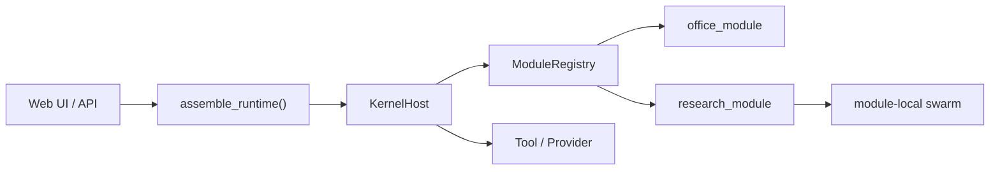

# Multi_Agent_Robot


[English README](README.en.md)

[](https://github.com/jonhncatt/Multi_Agent_Robot/actions/workflows/regression-ci.yml)
[](requirements.txt)
[](https://fastapi.tiangolo.com/)
[](LICENSE)

`Multi_Agent_Robot` 是一个本地 Agent OS 风格系统。

它更像一条稳固的船体：底盘结实，模块、工具和工作流都可以按需装载。

重点不是把所有能力塞进一个大 prompt，而是把下面几层拆开并稳定下来：

- 内核：`KernelHost`
- 模块：业务模块与系统模块分离
- Tool / Provider：统一能力接口与可替换实现
- 运行质量：`gate / smoke / replay / metrics`
- 运维入口：Web UI、API、runbook

## 现在能做什么

- 运行 `Multi_Agent_Robot` 主产品界面
- 运行 `Multi_Agent_Robot Lab` 实验界面
- 在 `office_module` 与 `research_module` 之间做正式模块分工
- 通过 Tool / Provider 路径执行本地工作区、联网等能力
- 用最小 demo、回归测试和运行指标验证改动

## 界面

### Multi_Agent_Robot


### Multi_Agent_Robot Lab


## 快速启动

环境：macOS / Linux / Windows，推荐 Python 3.11。

```bash
git clone https://github.com/jonhncatt/Multi_Agent_Robot.git
cd Multi_Agent_Robot
python3 -m venv .venv
source .venv/bin/activate
pip install -r requirements.txt
cp .env.example .env
# 填入 OPENAI_API_KEY，或者直接使用现成的 Codex auth
./run.sh
```

主界面：<http://127.0.0.1:8080>

实验界面：

```bash
./run-role-agent-lab.sh
```

地址：<http://127.0.0.1:8081>

## 最常用入口

- 主产品：`./run.sh` 或 `./run-multi-agent-robot.sh`
- 实验甲板：`./run-role-agent-lab.sh`
- 旧入口兼容：`./run-kernel-robot.sh`
- 最小 smoke：`python scripts/demo_minimal_agent_os.py --check`
- Research 模块 demo：`python scripts/demo_research_module.py --check`
- Swarm demo：`python scripts/demo_research_swarm.py --check`

## 核心结构



## 先看哪里

### 想理解主装配

- `app/bootstrap/assemble.py`
- `app/kernel/host.py`
- `app/product_profiles.py`

### 想改业务模块

- `app/business_modules/office_module/module.py`
- `app/business_modules/research_module/module.py`
- `docs/modules/module_integration_guide.md`

### 想看运行链路

- `docs/architecture/current_execution_path.md`
- `docs/observability/trace_guide.md`
- `docs/observability/troubleshooting.md`

### 想看平台边界

- `docs/architecture/platform_boundaries.md`
- `docs/architecture/swarm_contract.md`
- `docs/migration/compatibility_shim_inventory.md`

## 质量验证

安装开发依赖：

```bash
pip install -r requirements-dev.txt
```

常用检查：

```bash
python scripts/demo_minimal_agent_os.py --check
pytest
```

## 项目目录

- `app/`: Web UI、API、内核、模块装配
- `packages/`: 共享 runtime 与模块边界
- `scripts/`: demo、辅助脚本、运行入口
- `tests/`: 回归测试
- `docs/`: 架构、模块、运维、观测文档

## 相关文档

- 模块接入：`docs/modules/module_integration_guide.md`
- Research 模块：`docs/modules/research_module.md`
- 平台指标：`docs/operations/platform_metrics.md`
- 里程碑：`docs/roadmap/agent_os_milestones.md`
- 进化方向（2026）：`docs/roadmap/evolution_direction_2026.md`
- Swarm 路线图：`docs/swarm-roadmap.md`

## 说明

- 未配置 `OPENAI_API_KEY` 也可以启动页面，但 `/api/chat` 不会真正工作
- 应用会自动读取项目根目录 `.env`
- `kernel_robot` 仍作为兼容别名保留，正式对外名称统一为 `Multi_Agent_Robot`
- 更详细的历史设计与迁移说明已经下沉到 `docs/`
