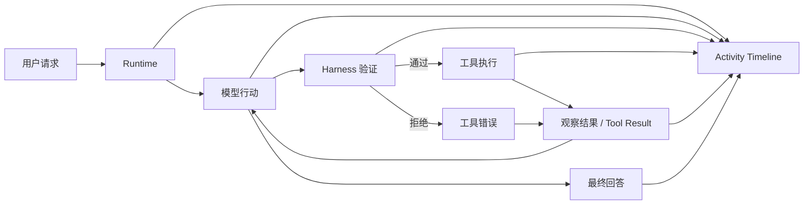

# Vintage Programmer


一个本地优先的 AI Agent 工作台，重点是可观察的 activity tracing（执行过程追踪）、可编辑 agent specs（Agent 规范）和 harness-validated execution（由 harness 验证的执行链路）。

**Vintage Programmer** 不是普通聊天 UI。  
它希望让用户看到 Agent 在一个 turn（用户一轮请求）里到底经历了什么：
**用户请求 -> 模型行动 -> harness 验证 -> 工具执行 -> 观察结果 -> 最终回答**

[English README](README.en.md) · [日本語 README](README.ja.md) · [中文镜像](README.zh-CN.md) · [Windows 指南](README.windows.md) · [发布流程](RELEASING.md) · [内部设计手册](docs/internal_design_manual.md)

当前稳定版本：`3.1.5W`

## Stable Runtime

3.1.5W 当前分支使用独立的全局 Skill Registry：支持只读 Built-in Skills 和通过 Vintage Programmer Git 仓库共享的 Team Skills。runtime 只注入带路径的轻量 `[available_skills]`；模型命中后用普通 `read_file` 按需读取完整 `SKILL.md`。

`save_skill` 只把可复用流程写入 `skills/team/<name>/SKILL.md`；保存位置由 VP 安装仓库决定，与当前选择的业务项目无关。内置 `create-team-skill` 指导 Agent 生成 Team Skill，Built-in Skills 保持只读。

## Max Output Tokens

推荐默认设置：

```env
VP_MAX_OUTPUT_TOKENS=16384
VP_MAX_USER_REQUEST_CHARS=4000000
VP_MAX_ATTACHMENT_CHARS=1000000
VP_CONTEXT_WINDOW_TOKENS=0
VP_CONTEXT_AUTO_COMPACT_TOKEN_LIMIT=0
VP_CONTEXT_AUTO_COMPACT_RATIO=0.9
VP_CONTEXT_DANGER_COMPACT_RATIO=0.95
VP_CONTEXT_HISTORY_SOFT_LIMIT_TOKENS=120000
VP_CONTEXT_EXACT_STALE_SEC=60
```

这个值是单次模型调用的输出上限，不是整个任务的总上限。默认 16384 适合 GPT-5.4 这类大上下文模型的长材料问答；长任务仍应通过多轮 model/tool loop 完成，而不是依赖一次 128K 级别的超大回复。
`VP_MAX_USER_REQUEST_CHARS` 是当前用户输入的安全字符上限；实际进入模型的内容还会按当前模型 context window 和输出预留做 token 预算裁剪。

Context 状态采用 Codex 风格的轻量常驻显示：聊天主路径只使用缓存或 quick 估算，不再每轮阻塞式精算 tokenizer。`/status` 会读取当前 thread 的 context 状态并打开详情；`/compact` 会手动整理旧历史并在运行记录中显示 context compaction 事件。GPT-5.4 默认按 272K 可用窗口、90% 自动整理线和 95% 危险线处理；真实 provider `input_tokens` 可用时优先于本地估算。只有在公司部署的可用窗口已经确认时，才设置 `VP_CONTEXT_WINDOW_TOKENS` 或绝对阈值 `VP_CONTEXT_AUTO_COMPACT_TOKEN_LIMIT`；值为 `0` 表示使用内置模型默认值。`VP_CONTEXT_HISTORY_SOFT_LIMIT_TOKENS` 只用于旧聊天/工具输出噪音，不适用于当前用户输入或附件原文。

## Python Commands

运行项目 Python 命令时，如果项目根目录存在 `./.venv/bin/python`，优先使用它执行测试、脚本和 `-m` 模块命令。Windows 上对应优先使用 `.venv\Scripts\python.exe`。如果没有项目虚拟环境，再使用可用的宿主 `python`；只有 `python` 不可用时才退回 `py`。不要默认假定 `python3` 一定存在。

## Python Version

当前稳定运行时推荐使用 Python `3.11`。Python `3.12` 也可接受。Python `3.13` 目前还不是主要测试环境，OCR、ONNXRuntime、图片/PDF 处理等依赖在不同平台上可能出现兼容性问题。

## Command Safety

`exec_command` 继续使用保守 allowlist，默认安全列表包含 `printf` 和 `dir`，并且 `VP_ALLOWED_COMMANDS` 是完整覆盖，不是增量追加。默认命令执行仍受当前权限模式和路径边界约束，且会检查 `rg /etc`、`git -C /tmp`、`python /tmp/a.py` 这类路径参数。`curl`、`wget`、`pip install`、`npm install`、`git pull/fetch` 等供应链相关命令默认不在安全列表；如果管理员显式加入 allowlist，Full Access 下也会先进入单次审批。危险删除、`sudo rm`、下载脚本 pipe shell 等模式仍会被硬拒绝。

## Session = Thread

`Session` 现在就是一条持久 Thread。模型输入按 typed transcript 回放真实的 `user`、`assistant`、`tool` 消息，最后追加当前用户消息；不再构造六/八要素 `ModelContext` JSON，也不再调用任务关系分类器。当前目录和权限合并进唯一的 SystemMessage，`AGENTS.md`、压缩摘要和附件作为带来源标记的上下文消息提供；`task_state`、`work_cursor`、RuntimeTrace 等状态只供 Harness、前端和审计使用。旧 Session 首次读取时会从原有 `turns` 自动生成 transcript。

## Manual Update

侧边栏“更新”按钮现在是手动应用仓库更新入口。只有用户点击时才会调用 `/api/app/update`，不会后台检查、轮询或自动 fetch。后端固定执行 `git fetch --tags origin`、`git reset --hard origin/<branch>`、`git pull --ff-only`，目标是 Vintage Programmer 应用仓库，不是当前 project root。更新会丢弃 tracked 文件的未提交修改，成功后需要重启应用或刷新页面以使用最新代码。

## Permission Profiles

默认权限模式是 `Auto`：可读写当前项目、可在当前项目内运行安全命令，但网络关闭。`Default` 是只读安全模式，仅允许读取/搜索工具，不写文件、不运行 shell、不开网络；`Full Access` 是最大信任模式，可按系统配置使用更大范围的读写和命令作用域并启用网络。网络下载或解压得到的代码会被标记为 tainted，执行前需要一次性确认；所有模式仍受路径边界、命令 allowlist 和危险命令拦截约束。

## Browser With Local Chrome Profile

默认 `browser_open` 仍使用 Playwright 管理的 headless Chromium。企业环境如果拦截 Chromium 安装或执行，可以改用本机已安装的 Google Chrome，并使用一个专用 profile 保存登录态：

```env
VP_BROWSER_MODE=chrome_profile
VP_BROWSER_CHANNEL=chrome
VP_BROWSER_HEADLESS=false
VP_BROWSER_USER_DATA_DIR=app/data/browser_profile
VP_BROWSER_CHROMIUM_SANDBOX=true
VP_BROWSER_DISABLE_PASSWORD_MANAGER=true
```

首次打开 Redmine、内部 wiki 等需要登录的站点时，Chrome 会以可见窗口打开。用户自己输入账号密码完成登录；后续 agent 可以在这个已登录 profile 里点击页面、读取当前页面文本和截图。`app/data/browser_profile` 是 VP 专用目录；不要把个人主 Chrome profile 直接作为 `VP_BROWSER_USER_DATA_DIR`。`VP_BROWSER_DISABLE_PASSWORD_MANAGER=true` 会禁止 Chrome 在 VP profile 里提示保存密码，但不会阻止站点 cookie/session 保留登录态。`VP_BROWSER_CHROMIUM_SANDBOX=true` 会避免 Chrome 显示 `--no-sandbox` 安全警告；如果某台机器的策略导致 Chrome 无法启动，再临时改成 `false` 排查。

## 这是什么

Vintage Programmer 是一个本地运行的 AI Agent 工作台，默认主 agent 是 `vintage_programmer`。

它把这些能力放在同一个仓库里：

- 基于 Chat Completions 的 runtime loop（运行时循环）
- 可观察的 activity timeline（执行时间线）和 progress checklist（进度清单）
- harness 侧的工具验证与执行
- 可直接编辑的本地 Markdown agent 规范
- 全局 Built-in Skills 与 Team Skills，按需加载完整 `SKILL.md`
- 面向 `zh-CN`、`ja-JP`、`en` 的多语言文案层

它不是一个只包一层聊天界面的壳，而是一个偏工程化、可观察、可调试的本地 Agent 工作台。

## 为什么做这个项目

很多 AI 聊天产品更关注最终回答。
Vintage Programmer 更关注回答背后的执行过程。

它适合这种场景：

- 想知道模型当前准备做什么
- 想知道模型打算调用哪个工具
- 想知道 runtime 是否允许这次调用
- 想知道工具返回了什么
- 想知道这些观察结果如何影响下一步
- 想知道最终回答是怎么形成的

这会让 Agent 更容易调试、更容易建立信任，也更容易继续迭代。

## 核心亮点

- **可观察 activity timeline**  
  能看到模型推进、工具调用、验证状态和回答生成过程。
- **模型主导、harness 验证执行**  
  由模型提出动作，由 runtime 验证工具名、参数和执行边界，再决定是否执行。
- **可编辑 Agent 规范**  
  主 agent 的行为由本地 Markdown 文件定义，可直接查看和修改。
- **全局 Skills 系统**
  Built-in Skills 随产品发布且只读；Team Skills 随 Vintage Programmer Git 仓库由团队共同维护，不会写入当前业务项目。
- **经过源码验证的 provider 配置**  
  README 和 `.env.example` 给出 OpenAI、OpenAI-compatible 网关、OpenRouter 和本地 Ollama 的常用配置示例；源码 provider presets 还覆盖 DeepSeek、Qwen、Moonshot 和 Groq。
- **多语言 UI 和文档**  
  用户可见文本通过 locale layer（本地化层）支持 `zh-CN`、`ja-JP`、`en`。

## 和普通 Chat UI 有什么不同

普通 Chat UI 更关注最终回答。
Vintage Programmer 更关注 Agent 的执行过程可见性。

默认可以看到：

- 模型当前理解和动作提案
- harness 验证结果
- 工具调用参数
- 工具返回结果和观察
- 进度 checklist
- runtime 统计信息
- 最终回答

因此它更适合用来开发、调试和演示 AI Agent，而不只是把模型当成聊天框。

## Runtime Flow


```mermaid
flowchart LR
    U["用户请求"] --> R["Runtime"]
    R --> M["模型行动"]
    M --> H["Harness 验证"]
    H -->|通过| T["工具执行"]
    H -->|拒绝| E["工具错误"]
    T --> O["观察结果 / Tool Result"]
    E --> O
    O --> M
    M --> A["最终回答"]
    R --> UI["Activity Timeline"]
    M --> UI
    H --> UI
    T --> UI
    O --> UI
    A --> UI
```

## 快速启动

### macOS / Linux

```bash
python -m venv .venv
source .venv/bin/activate
pip install -r requirements.txt
python -m playwright install chromium
cp .env.example .env
./run.sh
```

打开：

- <http://127.0.0.1:8080>

项目级 Python 模块命令建议优先使用 `./.venv/bin/python -m ...`；如果没有 `.venv`，再使用 `python -m ...`。只有在 Windows 上 `python` 不可用时，再考虑 `py -m ...`。

### Windows

Windows 版本的推荐启动方式见 [README.windows.md](README.windows.md)。

## `.env` 最小配置

复制 `.env.example` 为 `.env`，然后只保留一个 provider profile（模型提供方配置）。

### OpenAI 官方

```env
VP_LLM_PROVIDER=openai
VP_OPENAI_API_KEY=your_key
VP_OPENAI_DEFAULT_MODEL=gpt-5.4
```

Vintage Programmer 使用显式的 provider API key 配置，不再从本地账号登录状态自动回退认证。

### OpenAI-compatible 网关

```env
VP_LLM_PROVIDER=openai_compatible
VP_OPENAI_COMPAT_API_KEY=your_gateway_key
VP_OPENAI_COMPAT_BASE_URL=https://your-gateway.example.com/v1
VP_OPENAI_COMPAT_CA_CERT_PATH=/absolute/path/to/your-root-ca.pem
VP_OPENAI_COMPAT_DEFAULT_MODEL=gpt-5.4
```

### OpenRouter

```env
VP_LLM_PROVIDER=openrouter
VP_OPENROUTER_API_KEY=your_openrouter_key
VP_OPENROUTER_BASE_URL=https://openrouter.ai/api/v1
VP_OPENROUTER_DEFAULT_MODEL=google/gemma-4-31b-it:free
VP_OPENROUTER_MODEL_FALLBACKS=nvidia/nemotron-3-super-120b-a12b:free
```

### 本地 Ollama

```env
VP_LLM_PROVIDER=ollama
VP_OLLAMA_BASE_URL=http://127.0.0.1:11434/v1
VP_OLLAMA_API_KEY=ollama
VP_OLLAMA_DEFAULT_MODEL=qwen2.5-coder:7b
```

更多选项见 [.env.example](.env.example)。

## 常用接口

这些都是本地应用自己的 HTTP 接口，不是 OpenAI 官方 API：

- `GET /api/health`
- `GET /api/bootstrap`
- `GET /api/runtime-status`
- `GET /api/projects`
- `GET /api/threads`
- `POST /api/chat`
- `POST /api/chat/stream`
- `GET /api/workbench/tools`
- `GET /api/workbench/skills`
- `GET /api/workbench/specs`

浏览器中的工作台 UI 会直接调用这些本地接口。

## Agent 规范

默认主 agent 是 `vintage_programmer`。
它的核心 Markdown 规范文件按 locale 存放：

- `agents/vintage_programmer/locales/zh-CN/`
- `agents/vintage_programmer/locales/en/`
- `agents/vintage_programmer/locales/ja-JP/`

每个目录包含 `soul.md`、`identity.md`、`agent.md`、`tools.md`。根目录同名文件仅作为旧 workspace fallback。

四个文件的职责边界是：

- `soul.md`：agent 的工作风格，例如工程化、结果导向、证据优先。
- `identity.md`：agent 在工作台里的岗位和职责边界。
- `agent.md`：执行协议，说明收到任务后如何判断、取证、修改、计划和交付。
- `tools.md`：工具路由和工具使用原则，说明什么时候使用 `read_file`、`search_codebase`、`apply_patch` 等工具。

`agent.md` 的 frontmatter 使用 `tool_scope` 表达 agent 的候选工具范围，当前可选值是 `all | read_only | none`。具体工具清单不再写在 `agent.md` 的 `allowed_tools` 里，而是来自 runtime/backend 的工具注册表，并继续受 `.env`、permission profile、RuntimeBoundary 和 ActionValidator 约束。

## Skills

VP 当前支持两类 skills：

```text
skills/builtin/<skill>/SKILL.md   # 产品维护、只读、全局发现
skills/team/<skill>/SKILL.md      # 团队维护、随 VP Git 仓库分发
```

仓库内置了一个启用的 Built-in Skill，用来指导 Agent 创建 Team Skill：

- `skills/builtin/create-team-skill/SKILL.md`

仓库还保留了一个禁用的 Team sample：

- `skills/team/sample-team-skill/SKILL.md`

两类 Skill 都独立于具体 Agent 存储和发现。当前只有 `vintage_programmer` 使用它们；未来其他 Agent 可以通过同一个 Registry 发现，再按能力选择。Built-in/Team 只表示维护来源与可变性，不绑定 Agent。

`SKILL.md` 只支持一个规范格式：

```markdown
---
name: repo-triage
description: Use when the user wants to inspect repository structure, recent changes, risks, or prepare a code investigation plan.
enabled: true
---

# Repo Triage

完整 skill 指令写在这里。
```

必填字段是 `name` 和 `description`；`enabled` 可省略，默认启用。不再支持旧字段 `id`、`title`、`summary`、`bind_to`。

runtime 启动和每次 run 只读取轻量 metadata，并把启用 Skill 的规范 key、名称、描述和 `SKILL.md` 绝对路径放入 `[available_skills]`。模型判断某个 Skill 与任务相关后，使用普通 `read_file` 读取完整 `SKILL.md`，再按其中的相对路径读取 `references/`、`scripts/` 等资源；没有额外的加载或解锁状态。skill key 形如 `builtin:create-team-skill` 或 `team:protocol-analysis`。如果两个目录存在同名 Skill，管理 API 中未限定作用域的引用会被拒绝，必须使用完整 key。

Agent 可以在用户目标允许时调用 `save_skill` 创建或更新 Team Skill；团队也可以通过管理界面或正常的 Git 评审流程随时改进 Team Skill。模型只提交逻辑名称和内容，由 Skill Registry 固定写入 VP 仓库的 `skills/team`，不接收物理路径。只有 Built-in Skill 只读。旧的 `system:` / `workspace:` key 和 API scope 暂时分别作为 `builtin:` / `team:` 的兼容别名。

已启用的 Skill 如果包含脚本，Agent 使用普通 `exec_command` 直接执行 `SKILL.md` 所在目录下的 Python、Shell、Node 或 PowerShell 脚本。脚本路径受统一 `RuntimeBoundary` 校验，执行工作目录仍是当前业务项目；禁用 Skill 不展示，也不会被加入本轮 Skill 读取/命令范围。`load_skill` 和 `run_skill_script` 不再属于模型工具。

团队提交前运行：

```bash
python scripts/migrate_skills.py --json
python scripts/validate_skills.py
```

校验会检查 schema、重名、疑似凭证和硬编码个人绝对路径。建议通过 GitLab Merge Request 审核 Team Skill，再由其他同事 pull 使用。

## Inline Code

如果你把代码、XML、HTML、JSON、YAML 或者较长文本直接贴进 composer，agent 应该优先分析这段 inline content（内联内容），而不是强制要求你先给出工作区文件路径。

## 多语言策略

当前支持：

- `zh-CN`
- `ja-JP`
- `en`

初始语言优先级按源码目前实现为：

```text
已保存的 Settings 选择
> 服务端默认语言（VP_DEFAULT_LOCALE）
> 浏览器语言
> ja-JP 兜底
```

这意味着仓库只维护一条主代码线，但用户可见 UI 和文档通过 locale layer 做本地化。

## 文档入口

- [README.md](README.md)
- [English README](README.en.md)
- [日本語 README](README.ja.md)
- [Windows 指南](README.windows.md)
- [发布流程](RELEASING.md)
- [内部设计手册](docs/internal_design_manual.md)
- [Runtime 可靠性说明](docs/runtime_reliability.md)

## 发布流程

正式发布流程当前是：

1. 在 `cleanup/*` 或其他发布候选分支完成改动。
2. 保持本地 runtime state（运行时本地状态）不进入 Git。
3. 在本地跑 release gates（发版检查）。
4. 向 `main` 发起 PR。
5. 只有回归通过后才合入 `main`。
6. 在发布提交上创建 annotated tag（带说明标签）。
7. 后续新改动从更新后的 `main` 再切新的候选分支。

完整说明见 [RELEASING.md](RELEASING.md)。
