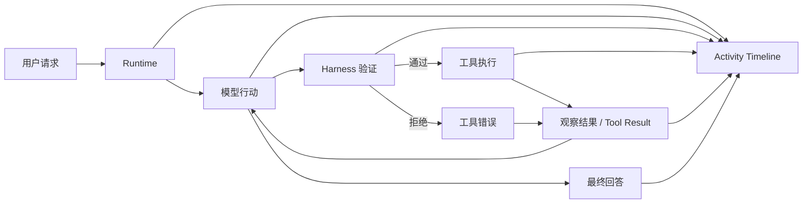

# Vintage Programmer


一个本地优先的 AI Agent 工作台，重点是可观察的 activity tracing（执行过程追踪）、可编辑 agent specs（Agent 规范）和 harness-validated execution（由 harness 验证的执行链路）。

**Vintage Programmer** 不是普通聊天 UI。  
它希望让用户看到 Agent 在一个 turn（用户一轮请求）里到底经历了什么：
**用户请求 -> 模型行动 -> harness 验证 -> 工具执行 -> 观察结果 -> 最终回答**

[English README](README.en.md) · [日本語 README](README.ja.md) · [中文镜像](README.zh-CN.md) · [Windows 指南](README.windows.md) · [发布流程](RELEASING.md) · [内部设计手册](docs/internal_design_manual.md)

当前稳定版本：`3.1.5f`

## Stable Runtime

3.1.5f 在 3.1.5e 的 delta-first task state merge 之上，补齐了真实观测闭环：run sidecar 现在持久化 `task_state` / `task_state_delta` / `task_state_validation`，Run/Debug 面板可直接查看关键 checkpoint 字段，并对缺失 `task_state_delta` 的非平凡执行轮给出显式 validation warning。

相对 3.1.5d，本版本补上了 `main.py` 的 delta-first merge 路径、无 delta 时的 fallback 回归测试，以及 Run 面板中的 `progress_basis` / `evidence_refs` 可视化。

## Max Output Tokens

推荐默认设置：

```env
VP_MAX_OUTPUT_TOKENS=4096
```

这个值是单次模型调用的输出上限，不是整个任务的总上限。长任务应通过多轮 model/tool loop 完成，而不是依赖一次超大回复。

## Python Commands

运行项目 Python 命令时，如果项目根目录存在 `./.venv/bin/python`，优先使用它执行测试、脚本和 `-m` 模块命令。Windows 上对应优先使用 `.venv\Scripts\python.exe`。如果没有项目虚拟环境，再使用可用的宿主 `python`；只有 `python` 不可用时才退回 `py`。不要默认假定 `python3` 一定存在。

## Python Version

稳定的 v2.9.x 运行时推荐使用 Python `3.11`。Python `3.12` 也可接受。Python `3.13` 目前还不是主要测试环境，OCR、ONNXRuntime、图片/PDF 处理等依赖在不同平台上可能出现兼容性问题。

## Command Safety

`exec_command` 继续使用保守 allowlist。v2.9.20 推荐的完整安全列表包含 `printf` 和 `dir`，并且 `VP_ALLOWED_COMMANDS` 是完整覆盖，不是增量追加。默认命令执行仍受当前权限模式和路径边界约束，且会检查 `rg /etc`、`git -C /tmp`、`python /tmp/a.py` 这类路径参数；高风险命令如 `rm`、`chmod`、`chown`、`curl`、`wget`、`sudo`、`dd`、`kill`、`pkill`、`brew`、`pip`、`pip3` 仍保持阻止。

## ModelContext

v2.9.20 的模型输入仍只渲染 `ModelContext`，它由六个清晰部分组成：`task`、`workspace`、`memory`、`plan`、`permissions`、`conversation`。`RuntimeTrace`、raw tool output、model draft、旧的 route/agent state 只用于调试或迁移，不再作为正常模型上下文来源。

## Manual Update

侧边栏“更新”按钮现在是手动应用仓库更新入口。只有用户点击时才会调用 `/api/app/update`，不会后台检查、轮询或自动 fetch。后端固定执行 `git fetch --tags origin`、`git reset --hard origin/<branch>`、`git pull --ff-only`，目标是 Vintage Programmer 应用仓库，不是当前 project root。更新会丢弃 tracked 文件的未提交修改，成功后需要重启应用或刷新页面以使用最新代码。

## Permission Profiles

默认权限模式是 `Auto`：可读写当前项目、可在当前项目内运行安全命令，并启用网络。`Default` 是只读安全模式，仅允许读取/搜索工具，不写文件、不运行 shell、不开网络；`Full Access` 是最大信任模式，可按系统配置使用更大范围的读写和命令作用域，但仍受路径边界、命令 allowlist 和危险命令拦截约束。

## 这是什么

Vintage Programmer 是一个本地运行的 AI Agent 工作台，默认主 agent 是 `vintage_programmer`。

它把这些能力放在同一个仓库里：

- 基于 Chat Completions 的 runtime loop（运行时循环）
- 可观察的 activity timeline（执行时间线）和 progress checklist（进度清单）
- harness 侧的工具验证与执行
- 可直接编辑的本地 Markdown agent 规范
- 可启用、可绑定到主 agent 的本地 skills
- 面向 `zh-CN`、`ja-JP`、`en` 的多语言文案层

它不是一个只包一层聊天界面的壳，而是一个偏工程化、可观察、可调试的本地 Agent 工作台。

## 为什么做这个项目

很多 AI 聊天产品更关注最终回答。
Vintage Programmer 更关注回答背后的执行过程。

它适合这种场景：

- 想知道模型当前准备做什么
- 想知道模型打算调用哪个工具
- 想知道 runtime 是否允许这次调用
- 想知道工具返回了什么
- 想知道这些观察结果如何影响下一步
- 想知道最终回答是怎么形成的

这会让 Agent 更容易调试、更容易建立信任，也更容易继续迭代。

## 核心亮点

- **可观察 activity timeline**  
  能看到模型推进、工具调用、验证状态和回答生成过程。
- **模型主导、harness 验证执行**  
  由模型提出动作，由 runtime 验证工具名、参数和执行边界，再决定是否执行。
- **可编辑 Agent 规范**  
  主 agent 的行为由本地 Markdown 文件定义，可直接查看和修改。
- **本地 Skills 系统**  
  可以在工作区内新增、启用、关闭和绑定 skills。
- **经过源码验证的 provider 配置**  
  当前 `.env.example` 和源码确认支持 OpenAI、OpenAI-compatible 网关、OpenRouter 和本地 Ollama。
- **多语言 UI 和文档**  
  用户可见文本通过 locale layer（本地化层）支持 `zh-CN`、`ja-JP`、`en`。

## 和普通 Chat UI 有什么不同

普通 Chat UI 更关注最终回答。
Vintage Programmer 更关注 Agent 的执行过程可见性。

默认可以看到：

- 模型当前理解和动作提案
- harness 验证结果
- 工具调用参数
- 工具返回结果和观察
- 进度 checklist
- runtime 统计信息
- 最终回答

因此它更适合用来开发、调试和演示 AI Agent，而不只是把模型当成聊天框。

## Runtime Flow


```mermaid
flowchart LR
    U["用户请求"] --> R["Runtime"]
    R --> M["模型行动"]
    M --> H["Harness 验证"]
    H -->|通过| T["工具执行"]
    H -->|拒绝| E["工具错误"]
    T --> O["观察结果 / Tool Result"]
    E --> O
    O --> M
    M --> A["最终回答"]
    R --> UI["Activity Timeline"]
    M --> UI
    H --> UI
    T --> UI
    O --> UI
    A --> UI
```

## 快速启动

### macOS / Linux

```bash
python -m venv .venv
source .venv/bin/activate
pip install -r requirements.txt
python -m playwright install chromium
cp .env.example .env
./run.sh
```

打开：

- <http://127.0.0.1:8080>

项目级 Python 模块命令建议优先使用 `./.venv/bin/python -m ...`；如果没有 `.venv`，再使用 `python -m ...`。只有在 Windows 上 `python` 不可用时，再考虑 `py -m ...`。

### Windows

Windows 版本的推荐启动方式见 [README.windows.md](README.windows.md)。

## `.env` 最小配置

复制 `.env.example` 为 `.env`，然后只保留一个 provider profile（模型提供方配置）。

### OpenAI 官方

```env
VP_LLM_PROVIDER=openai
VP_OPENAI_API_KEY=your_key
VP_OPENAI_DEFAULT_MODEL=gpt-5.1-chat
```

Vintage Programmer 使用显式的 provider API key 配置，不再从本地账号登录状态自动回退认证。

### OpenAI-compatible 网关

```env
VP_LLM_PROVIDER=openai_compatible
VP_OPENAI_COMPAT_API_KEY=your_gateway_key
VP_OPENAI_COMPAT_BASE_URL=https://your-gateway.example.com/v1
VP_OPENAI_COMPAT_CA_CERT_PATH=/absolute/path/to/your-root-ca.pem
VP_OPENAI_COMPAT_DEFAULT_MODEL=gpt-5.1-chat
```

### OpenRouter

```env
VP_LLM_PROVIDER=openrouter
VP_OPENROUTER_API_KEY=your_openrouter_key
VP_OPENROUTER_BASE_URL=https://openrouter.ai/api/v1
VP_OPENROUTER_DEFAULT_MODEL=google/gemma-4-31b-it:free
VP_OPENROUTER_MODEL_FALLBACKS=nvidia/nemotron-3-super-120b-a12b:free
```

### 本地 Ollama

```env
VP_LLM_PROVIDER=ollama
VP_OLLAMA_BASE_URL=http://127.0.0.1:11434/v1
VP_OLLAMA_API_KEY=ollama
VP_OLLAMA_DEFAULT_MODEL=qwen2.5-coder:7b
```

更多选项见 [.env.example](.env.example)。

## 接口说明

这些都是本地应用自己的 HTTP 接口，不是 OpenAI 官方 API：

- `GET /api/health`
- `GET /api/runtime-status`
- `POST /api/chat`
- `POST /api/chat/stream`
- `GET /api/workbench/tools`
- `GET /api/workbench/skills`
- `GET /api/workbench/specs`

浏览器中的工作台 UI 会直接调用这些本地接口。

## Agent 规范

默认主 agent 是 `vintage_programmer`。
它的核心 Markdown 规范文件是：

- `agents/vintage_programmer/soul.md`
- `agents/vintage_programmer/identity.md`
- `agents/vintage_programmer/agent.md`
- `agents/vintage_programmer/tools.md`

本地化版本位于：

- `agents/vintage_programmer/locales/en/`
- `agents/vintage_programmer/locales/ja-JP/`

## 本地 Skills

本地 skills 固定放在：

```text
workspace/skills/<skill_id>/SKILL.md
```

只有 `enabled: true` 且 `bind_to` 包含 `vintage_programmer` 的 skill，才会注入主 agent。

## Inline Code

如果你把代码、XML、HTML、JSON、YAML 或者较长文本直接贴进 composer，agent 应该优先分析这段 inline content（内联内容），而不是强制要求你先给出工作区文件路径。

## 多语言策略

当前支持：

- `zh-CN`
- `ja-JP`
- `en`

初始语言优先级按源码目前实现为：

```text
已保存的 Settings 选择
> 服务端默认语言（VP_DEFAULT_LOCALE）
> 浏览器语言
> ja-JP 兜底
```

这意味着仓库只维护一条主代码线，但用户可见 UI 和文档通过 locale layer 做本地化。

## 文档入口

- [README.md](README.md)
- [English README](README.en.md)
- [日本語 README](README.ja.md)
- [Windows 指南](README.windows.md)
- [发布流程](RELEASING.md)
- [内部设计手册](docs/internal_design_manual.md)

## 发布流程

正式发布流程当前是：

1. 在 `cleanup/*` 或其他发布候选分支完成改动。
2. 保持本地 runtime state（运行时本地状态）不进入 Git。
3. 在本地跑 release gates（发版检查）。
4. 向 `main` 发起 PR。
5. 只有回归通过后才合入 `main`。
6. 在发布提交上创建 annotated tag（带说明标签）。
7. 后续新改动从更新后的 `main` 再切新的候选分支。

完整说明见 [RELEASING.md](RELEASING.md)。
