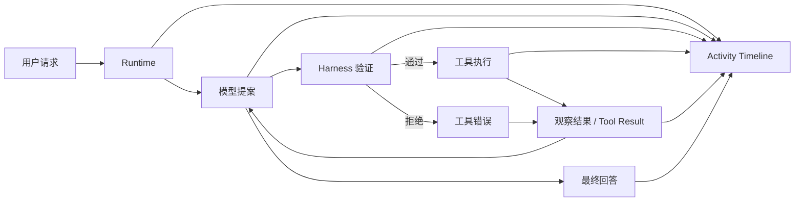

# Vintage Programmer


一个本地优先的 AI Agent 工作台，重点是 Codex 风格的 activity tracing（执行过程追踪）、可编辑 agent specs（Agent 规范）和 harness-validated execution（由 harness 验证的执行链路）。

**Vintage Programmer** 不是普通聊天 UI。  
它希望让用户看到 Agent 在一个 turn（用户一轮请求）里到底经历了什么：
**用户请求 -> 模型提案 -> harness 验证 -> 工具执行 -> 观察结果 -> 最终回答**

[中文首页](README.md) · [English README](README.en.md) · [日本語 README](README.ja.md) · [Windows 指南](README.windows.md) · [发布流程](RELEASING.md) · [内部设计手册](docs/internal_design_manual.md)

当前稳定版本：`v2.7.4`

## 这是什么

Vintage Programmer 是一个本地运行的 AI Agent 工作台，默认主 agent 是 `vintage_programmer`。

它把这些能力放在同一个仓库里：

- 基于 Chat Completions 的 runtime loop（运行时循环）
- Codex 风格的 activity timeline（执行时间线）和 progress checklist（进度清单）
- harness 侧的工具验证与执行
- 可直接编辑的本地 Markdown agent 规范
- 可启用、可绑定到主 agent 的本地 skills
- 面向 `zh-CN`、`ja-JP`、`en` 的多语言文案层

它不是一个只包一层聊天界面的壳，而是一个偏工程化、可观察、可调试的本地 Agent 工作台。

## 为什么做这个项目

很多 AI 聊天产品更关注最终回答。
Vintage Programmer 更关注回答背后的执行过程。

它适合这种场景：

- 想知道模型当前准备做什么
- 想知道模型打算调用哪个工具
- 想知道 runtime 是否允许这次调用
- 想知道工具返回了什么
- 想知道这些观察结果如何影响下一步
- 想知道最终回答是怎么形成的

这会让 Agent 更容易调试、更容易建立信任，也更容易继续迭代。

## 核心亮点

- **Codex 风格 activity timeline**  
  能看到模型推进、工具调用、验证状态和回答生成过程。
- **模型主导、harness 验证执行**  
  由模型提出动作，由 runtime 验证工具名、参数和执行边界，再决定是否执行。
- **可编辑 Agent 规范**  
  主 agent 的行为由本地 Markdown 文件定义，可直接查看和修改。
- **本地 Skills 系统**  
  可以在工作区内新增、启用、关闭和绑定 skills。
- **经过源码验证的 provider 配置**  
  当前 `.env.example` 和源码确认支持 OpenAI、OpenAI-compatible 网关、OpenRouter 和本地 Ollama。
- **多语言 UI 和文档**  
  用户可见文本通过 locale layer（本地化层）支持 `zh-CN`、`ja-JP`、`en`。

## 和普通 Chat UI 有什么不同

普通 Chat UI 更关注最终回答。
Vintage Programmer 更关注 Agent 的执行过程可见性。

默认可以看到：

- 模型当前理解和动作提案
- harness 验证结果
- 工具调用参数
- 工具返回结果和观察
- 进度 checklist
- runtime 统计信息
- 最终回答

因此它更适合用来开发、调试和演示 AI Agent，而不只是把模型当成聊天框。

## Runtime Flow



## 快速启动

### macOS / Linux

```bash
python3 -m venv .venv
source .venv/bin/activate
pip install -r requirements.txt
python3 -m playwright install chromium
cp .env.example .env
./run.sh
```

打开：

- <http://127.0.0.1:8080>

### Windows

Windows 版本的推荐启动方式见 [README.windows.md](README.windows.md)。

## `.env` 最小配置

复制 `.env.example` 为 `.env`，然后只保留一个 provider profile（模型提供方配置）。

### OpenAI 官方

```env
VP_LLM_PROVIDER=openai
VP_OPENAI_API_KEY=your_key
VP_OPENAI_DEFAULT_MODEL=gpt-5.1-chat
```

### OpenAI 官方 + Codex auth

```env
VP_LLM_PROVIDER=openai
VP_CODEX_HOME=/absolute/path/to/.codex
VP_CODEX_AUTH_FILE=/absolute/path/to/.codex/auth.json
VP_OPENAI_DEFAULT_MODEL=gpt-5.1-chat
```

如果没有填写 `VP_OPENAI_API_KEY`，但本地存在 `VP_CODEX_AUTH_FILE`，程序可以自动使用 Codex auth。

### OpenAI-compatible 网关

```env
VP_LLM_PROVIDER=openai_compatible
VP_OPENAI_COMPAT_API_KEY=your_gateway_key
VP_OPENAI_COMPAT_BASE_URL=https://your-gateway.example.com/v1
VP_OPENAI_COMPAT_CA_CERT_PATH=/absolute/path/to/your-root-ca.pem
VP_OPENAI_COMPAT_DEFAULT_MODEL=gpt-5.1-chat
```

### OpenRouter

```env
VP_LLM_PROVIDER=openrouter
VP_OPENROUTER_API_KEY=your_openrouter_key
VP_OPENROUTER_BASE_URL=https://openrouter.ai/api/v1
VP_OPENROUTER_DEFAULT_MODEL=google/gemma-4-31b-it:free
VP_OPENROUTER_MODEL_FALLBACKS=nvidia/nemotron-3-super-120b-a12b:free
```

### 本地 Ollama

```env
VP_LLM_PROVIDER=ollama
VP_OLLAMA_BASE_URL=http://127.0.0.1:11434/v1
VP_OLLAMA_API_KEY=ollama
VP_OLLAMA_DEFAULT_MODEL=qwen2.5-coder:7b
```

更多选项见 [.env.example](.env.example)。

## 接口说明

这些都是本地应用自己的 HTTP 接口，不是 OpenAI 官方 API：

- `GET /api/health`
- `GET /api/runtime-status`
- `POST /api/chat`
- `POST /api/chat/stream`
- `GET /api/workbench/tools`
- `GET /api/workbench/skills`
- `GET /api/workbench/specs`

浏览器中的工作台 UI 会直接调用这些本地接口。

## Agent 规范

默认主 agent 是 `vintage_programmer`。
它的核心 Markdown 规范文件是：

- `agents/vintage_programmer/soul.md`
- `agents/vintage_programmer/identity.md`
- `agents/vintage_programmer/agent.md`
- `agents/vintage_programmer/tools.md`

本地化版本位于：

- `agents/vintage_programmer/locales/en/`
- `agents/vintage_programmer/locales/ja-JP/`

## 本地 Skills

本地 skills 固定放在：

```text
workspace/skills/<skill_id>/SKILL.md
```

只有 `enabled: true` 且 `bind_to` 包含 `vintage_programmer` 的 skill，才会注入主 agent。

## Inline Code

如果你把代码、XML、HTML、JSON、YAML 或者较长文本直接贴进 composer，agent 应该优先分析这段 inline content（内联内容），而不是强制要求你先给出工作区文件路径。

## 多语言策略

当前支持：

- `zh-CN`
- `ja-JP`
- `en`

初始语言优先级按源码目前实现为：

```text
已保存的 Settings 选择
> 服务端默认语言（VP_DEFAULT_LOCALE）
> 浏览器语言
> ja-JP 兜底
```

这意味着仓库只维护一条主代码线，但用户可见 UI 和文档通过 locale layer 做本地化。

## 文档入口

- [README.md](README.md)
- [English README](README.en.md)
- [日本語 README](README.ja.md)
- [Windows 指南](README.windows.md)
- [发布流程](RELEASING.md)
- [内部设计手册](docs/internal_design_manual.md)

## 发布流程

正式发布流程当前是：

1. 在 `codex/*` 候选分支完成改动。
2. 保持本地 runtime state（运行时本地状态）不进入 Git。
3. 在本地跑 release gates（发版检查）。
4. 向 `main` 发起 PR。
5. 只有回归通过后才合入 `main`。
6. 在发布提交上创建 annotated tag（带说明标签）。
7. 后续新改动从更新后的 `main` 再切新的 `codex/*` 分支。

完整说明见 [RELEASING.md](RELEASING.md)。
