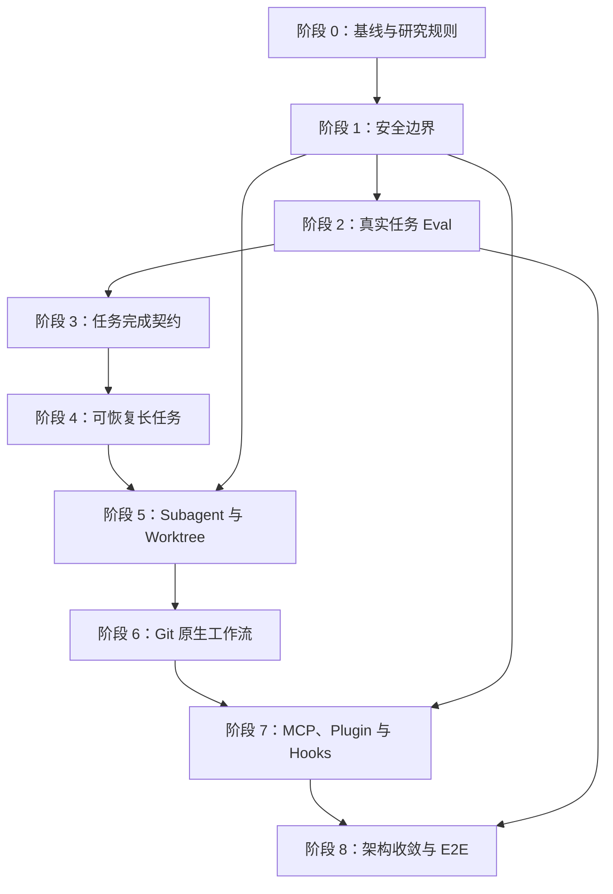

# Codex 对标研究与演进路线图

> 文档状态：初稿，后续作为讨论、研究、决策和实施的共同入口。
>
> 基线日期：2026-07-10
>
> 适用项目：Vintage Programmer

## 1. 为什么建立这份文档

Vintage Programmer 已经具备较完整的 Agent Runtime 基础，包括模型主导的工具循环、Tool Guard、权限 profile、上下文压缩、执行轨迹、Skills 渐进加载和线程级并发。

下一阶段不以“复制 Codex 的所有功能”为目标，而是研究并吸收其中适合本项目的设计，使系统在以下方面逐步提升：

- 默认安全；
- 任务确实完成，而不只是生成回答；
- 长任务可以恢复；
- 多任务并行时互不干扰；
- Git 修改过程可查看、可审查、可撤销；
- 能通过标准方式扩展外部工具和工作流；
- 有真实任务评测，而不只依赖单元测试；
- 代码结构和测试体系能够支撑长期迭代。

本文档记录的是研究路线，不代表所有条目都已决定实施。每个阶段都必须先完成理解、取证和方案比较，再进入开发。

## 2. 建议的协作方式

采用“先形成文档初稿，再逐项聊天”的方式：

1. 文档先给出问题、术语、候选方案和验收标准。
2. 对不清楚或有分歧的内容，在对应阶段下记录问题。
3. 只有标记为“已决策”的方案才进入实施计划。
4. 每次实现只处理一个边界清楚、可以验证的小目标。
5. 完成后补充测试证据、运行结果和遗留问题。

建议使用以下状态：

| 状态 | 含义 |
|---|---|
| `待研究` | 只知道方向，还没有充分取证。 |
| `讨论中` | 正在澄清目标、范围或方案。 |
| `已决策` | 已明确采用的方案和不采用的方案。 |
| `实施中` | 已进入代码修改。 |
| `已验证` | 实现完成，并有测试或实际运行证据。 |
| `暂缓` | 当前不做，同时保留暂缓原因。 |

## 3. 当前基线

截至基线日期，项目已经具备：

- 模型提出工具调用、Harness 校验、工具结果回灌的多轮执行链路；
- 文件读取、搜索、补丁、命令、网页、浏览器、文档和图片等工具；
- Default、Auto、Full Access 权限 profile；
- 命令 allowlist、路径边界、危险命令阻止和一次性批准；
- 长任务重复检测、无进展检测、自动 replan 和取消；
- 自动与手动上下文压缩；
- 运行轨迹、工具事件、阶段耗时和 token 统计；
- system/workspace Skills 及渐进加载；
- 项目、线程、附件和会话持久化；
- 不同线程并发、单线程串行的运行队列；
- 529 个现有测试通过。

已知主要缺口：

- 本地服务默认网络边界过宽；
- 自更新可能丢弃未提交修改；
- `evals/` 缺少当前文档所引用的可执行 runner；
- 尚无严格的“任务完成”判断；
- 长任务不能在进程重启后完整恢复；
- 没有真正的 Subagent 编排和 Worktree 生命周期管理；
- 缺少 Git 原生 Review、Stage、Commit、Push、PR 流程；
- 没有 MCP 和可分发 Plugin 体系；
- 前后端核心文件较大，真实浏览器端到端测试不足。

## 3.1 已确认的产品约束与使用场景

以下信息已由项目 owner 确认，应当作为后续设计的前提，而不是继续保持开放假设：

### 用户与部署方式

- 项目不只是个人使用，也有多位同事使用；
- 每位用户在自己的电脑上运行独立实例；
- 暂时不需要从局域网其他机器访问；
- 当前目标不是中心化、多租户的团队服务；
- 团队能力应通过统一版本、配置、Skills、规则和评测标准共享，而不是共享同一个运行中的本地实例。

因此，阶段 1 的默认网络策略已经明确：服务默认只绑定 loopback 地址，不提供局域网监听。

### 三个核心使用场景

1. 简单对话：普通问答不应强制进入复杂任务模式，也不应产生不必要的工具调用。
2. 大量文件分析：导入较多文件，可靠读取、检索、总结和按要求分析，并能指出结论来自哪些文件或片段。
3. 规格驱动的代码生成：根据现有测试规格、规则和参考代码生成新代码，并执行必要验证。

这三个场景将成为第一批真实任务 Eval 的主线。后续新增能力必须说明它改善了哪一个核心场景，或者解决了哪个基础可靠性问题。

当前已确认的输入与产物形式：

- 大量文件分析的典型输入包括 PDF 规格书、Excel 规格书和 C++ 源代码；
- C++ 源代码至少应覆盖 `.cpp`，后续建立样本时同时统计实际出现的头文件和其他相关后缀；
- 规格驱动生成的主要产物是 C++ 代码和 Markdown 文档；
- 文件数量、单文件大小和任务总大小尚未量化，不能先用主观定义代替真实工作负载；
- C++ 项目实际使用的构建系统、测试框架、测试规格格式和规则文件位置仍需从代表性仓库取证。

### Provider 约束

- 公司当前只提供 Chat Completions 风格接口；
- 不能假设存在 Responses API、OpenAI 托管工具、后台模式或服务端 response state；
- 需要尽可能在这一约束下实现接近 Codex 的本地体验；
- 多 provider 兼容仍有价值，但近期首先保证公司接口上的稳定体验。
- 公司环境使用 `openai_compatible` provider 和 `gpt-5.4` 模型配置；
- 实测已经确认非流式 Chat Completion、streaming、function/tool calling、指定 `tool_choice`、tool call ID 和 JSON 参数均可用；
- 尚未验证同一轮多个 tool calls、完整 tool-result 回灌、严格 structured output、上下文上限和各类错误恢复，因此不能把一次 dummy tool call 等同于完整 Agent 契约已经通过。

### Subagent 方向

- 希望系统在适合时自动使用 Subagent；
- Subagent 必须在 UI 中有可见状态；
- 第一版不为 Subagent 创建独立聊天页或侧边栏任务；
- Subagent 作为主任务执行流中的可折叠卡片出现：默认展示名称、目标、状态、耗时和结果摘要，展开后查看工具活动与详细输出；
- 主 Agent 仍是唯一直接与用户对话、汇总子任务和给出最终结果的角色；
- 自动委派必须受并发数、预算、任务边界和递归深度控制；
- 第一版自动委派优先用于相互独立的只读调查，不立即开放无限制并行写入。

### Git 平台

- 团队使用公司内部 GitLab，而不是 GitHub；
- 希望最终支持 Commit、Push 和 Merge Request；
- GitLab Self-Managed 应作为正式兼容目标；
- 产品界面和内部模型应使用通用 Git 概念，并将 GitLab 的交付对象称为 Merge Request（MR），不把 GitHub PR 写死在核心层。
- 公司 GitLab 页面可以看到 Personal Access Token 创建入口，现阶段视为“很可能可用、仍需实际验证”；
- GitLab 具体版本、允许的 PAT scope、公司策略以及是否安装或允许使用 `glab` 尚未确认；
- 第一版设计不强依赖 `glab`：本地提交和 push 使用 Git，MR 等平台能力通过 GitLab adapter 调用 API，`glab` 只作为可选增强。

### 外部集成优先级

- 近期不需要 GitLab 之外的外部系统；
- 优先把内部本地工作流、公司模型接口和 GitLab 做稳定；
- MCP、通用 Plugin 和 marketplace 保留在后续阶段，不作为近期主线。

## 3.2 Chat Completions 条件下的能力边界

Chat Completions 不会阻止本项目实现大部分 Codex-like 产品体验，但需要本地 Harness 承担更多职责。

### 可以由本地 Harness 实现

- 多轮工具调用和工具结果回灌；
- 文件、命令、浏览器和 Git 工具；
- 任务状态、计划、完成契约和 checkpoint；
- 上下文裁剪、摘要和 compaction；
- Subagent：每个 Subagent 使用独立消息历史和模型调用；
- Worktree 隔离；
- 后台运行队列、取消、超时、重试和恢复；
- GitLab Commit、Push、MR 和 Review 工作流；
- Skills、项目规则和本地记忆；
- 运行轨迹、token 统计和用户可见状态。

### 不能直接依赖

- Responses API 的服务端 response state；
- Responses API background mode；
- 只在 Responses API 或 Codex 产品中提供的托管工具；
- 只支持 Responses API 的 Codex 专用模型；
- OpenAI 服务端替本项目保存的 Agent 任务状态；
- 未经验证的 parallel tool calls、strict structured output 或 provider 特有字段。

### 必须先完成的 Provider 能力契约测试

为公司接口建立一个不包含业务逻辑的 conformance suite，至少检测：

- 是否支持 `stream=true`，以及流式 chunk 格式；
- 是否支持 `tools` / function calling；
- 工具调用 ID、参数和 `finish_reason` 的实际格式；
- 是否支持同一轮多个 tool calls；
- 是否支持 `tool_choice`；
- 是否支持 JSON/structured output，以及严格程度；
- system、user、assistant、tool 消息的兼容性；
- 最大上下文、最大输出和超限错误格式；
- 超时、断流、限流、401、429、5xx 的错误结构；
- 请求取消后，连接和本地任务状态如何收口；
- 模型是否稳定遵守工具 schema 和长任务提示；
- 网关是否保留 usage、model、request ID 等诊断字段。

测试结果应生成一个 provider capability profile。Runtime 只能根据已验证能力启用功能，不能仅根据 provider 名称猜测。

## 4. 简明术语表

### Harness

模型之外的执行控制层。模型负责提出动作，Harness 负责判断动作是否允许、执行工具、记录结果并控制循环。

### Task completion contract

任务完成契约。它明确“什么才算做完”，例如文件已修改、指定测试已通过、没有未处理的必需步骤。它不同于普通 checklist：checklist 描述计划，完成契约决定是否可以正式收口。

### Eval runner

自动执行评测案例的程序。它读取案例、准备测试工作区、运行 Agent、收集修改和轨迹，再用确定性规则或评分器判断任务是否成功。

### Checkpoint

任务检查点。它保存目标、已完成步骤、重要证据、失败尝试、当前文件和下一动作，使任务在刷新、失败或重启后可以继续。

### Subagent

由主 Agent 派出的专门 Agent。它适合处理可以独立进行的子任务，例如一个 Agent 调查后端，另一个调查前端，主 Agent 最后汇总。

### Git worktree

同一 Git 仓库的独立工作目录。不同任务可以在不同 worktree 和分支里修改代码，避免同时写入同一份文件。

### MCP

Model Context Protocol。它让 Agent 用标准方式连接外部工具或数据，例如 GitHub、Figma、数据库、内部文档和浏览器服务。

### Plugin

可安装、可分发的能力包。它通常可以包含 Skills、MCP 配置、Hooks、资源文件和元数据。Skill 更偏向“如何完成一种工作”，Plugin 更偏向“如何打包并分发一组能力”。

### Hook

在 Agent 生命周期的固定时机执行的确定性逻辑，例如工具调用前检查密钥、工具调用后记录审计、任务结束前运行验证。

## 5. 总体阶段

| 阶段 | 主题 | 核心结果 | 当前状态 |
|---|---|---|---|
| 0 | 基线、场景与 Provider 契约 | 建立真实场景基线，并确认公司接口能力 | `讨论中` |
| 1 | 安全边界与安全更新 | 默认本地安全，用户修改不会被更新流程破坏 | `讨论中` |
| 2 | 真实任务 Eval | 测量对话、文件分析和代码生成的真实成功率 | `待研究` |
| 3 | 任务完成契约 | Agent 能判断任务是否真的完成 | `待研究` |
| 4 | 可恢复长任务 | 刷新、失败或重启后可以继续 | `待研究` |
| 5 | Subagent 与 Worktree | 并行任务可见、可控、互不干扰 | `待研究` |
| 6 | GitLab 原生工作流 | 修改可以审查、选择、提交并通过 MR 交付 | `待研究` |
| 7 | MCP、Plugin 与 Hooks | 建立标准、可治理的扩展体系 | `暂缓` |
| 8 | 架构收敛与 E2E | 降低维护成本，验证完整用户流程 | `待研究` |

阶段原则：原则上按顺序推进。允许提前研究后续阶段，但在前置安全性和可靠性未完成前，不应大规模扩张生态或并发能力。

## 6. 阶段 0：基线、场景与 Provider 契约

### 目标

让后续每次研究都有明确的问题、证据、决策和验证结果，并确定公司 Chat Completions 接口究竟支持什么，避免只凭印象模仿 Codex 或猜测网关能力。

### 研究问题

- 大量文件的典型数量、格式、总大小和期望输出是什么？
- 规格驱动代码生成主要涉及哪些语言、测试框架和仓库规模？
- 公司网关实际支持哪些 Chat Completions 字段和流式事件？
- 公司允许哪些认证方式、日志字段和本地凭证存储方式？
- 对标 Codex 时，三个核心场景各自最重要的体验指标是什么？

### 交付物

- 一份核心用户和场景说明；
- 一份当前能力矩阵；
- 一份研究记录模板；
- 一套阶段状态和决策记录规则；
- 当前测试、性能和安全基线。
- 一份公司 Chat Completions provider capability profile；
- 三个核心场景的可重复基线任务和数据集。

### 验收标准

- 每个阶段都有 owner、范围、非目标和退出条件；
- 所有重要设计决定都能追溯到源码证据、测试或官方资料；
- 不以“Codex 有这个功能”作为唯一实施理由。
- Runtime 不会对未经验证的 provider 能力做乐观假设；
- 简单对话、大量文件分析和规格驱动代码生成都有基线结果。

### 已加入的探测工具

仓库已加入：

```text
scripts/check_provider_conformance.py
```

它使用当前 `.env` 和 provider 配置执行三个小型、无业务副作用的请求：

- 非流式 Chat Completion；
- 短文本流式 Chat Completion；
- 强制调用一个不实际执行的 dummy function。

基本用法：

```bash
python scripts/check_provider_conformance.py --dry-run
python scripts/check_provider_conformance.py
python scripts/check_provider_conformance.py --model <configured-model>
```

报告写入被 Git 忽略的 `artifacts/provider_conformance/`，不包含 API Key、完整 base URL、provider 用户 ID 或原始错误 metadata。探测不会修改应用配置，也不会自动启用产品 streaming。

流式报告包含：

- time to first event；
- time to first content；
- chunk 数量、频率和大小；
- 本地探测进程 CPU 时间与 Python 峰值分配；
- 16/33/50/100ms 前端合并刷新模拟；
- 对当前逐 delta UI 更新压力的风险判断。

个人电脑的 `.env` 激活的是 OpenRouter 免费模型。该环境的已有结果只用于验证脚本本身：

- 当前 primary 免费模型遇到 HTTP 429，不能用于能力结论；
- configured fallback 的非流式与流式请求成功；
- fallback 流式测试约产生 5–7 个文本 chunk/秒；
- 探测进程在等待流式响应期间约占单核 2.4%–7.1%，说明该样本的本地传输 CPU 压力较低；
- fallback 的 dummy tool call 曾成功，也出现过一次空 choices，因此暂记为“协议可用但稳定性待测”；
- 以上结果不用于判断公司 Chat Completions 网关能力。

公司电脑已经使用内部 base URL、自定义 CA 和 `gpt-5.4` 完成两次探测。当前可以记录为正式的初步 capability profile：

- 非流式 Chat Completion：支持；
- streaming：支持；
- function/tool calling：支持，强制 dummy function call 的名称、call ID 和 JSON 参数符合当前契约；
- 最近一次 stream TTFC 为 `1710.58 ms`，前一次为 `2095.7 ms`；
- 两次活跃文本 chunk 频率分别约为 `70.03 chunks/s` 和 `855.23 chunks/s`，说明公司网关的交付节奏可能高度可变并出现突发输出；
- 探针记录的本地 CPU 只覆盖 Python 客户端进程，不包含真实浏览器解析、状态更新、Markdown 渲染和绘制开销；最近一次显示 `0.0%` 也可能只是短采样经四舍五入后的结果；
- 当前逐 delta 更新 UI 的风险为 high，初始合并刷新间隔采用探针建议的 `100 ms`；在真实浏览器 A/B 验证通过前，不默认启用产品 streaming。

因此，streaming 与基础 tool calling 不再是开放问题；阶段 0 后续只继续验证多 tool calls、tool-result 回灌、structured output、上下文限制、取消和错误契约。

## 7. 阶段 1：安全边界与安全更新

### 通俗解释

本项目拥有读文件、写文件和执行命令的能力，因此“本地运行”不自动等于安全。首先要确保其他设备、网页或恶意请求不能轻易调用这些能力；同时应用更新不能删除用户尚未提交的工作。

### 目标

- 默认只允许本机访问；
- 所有写入和执行 API 有明确的请求来源保护；
- 外部访问必须由用户显式开启；
- 自更新遇到 dirty worktree 时不会执行破坏性操作；
- 关键操作留下可审计记录。

### 研究问题

- 已决策：默认绑定 `127.0.0.1` 或等价 loopback 地址，不提供局域网访问；
- 是否需要每次启动生成本地 bearer token？
- Web UI 和 API 是否需要 CSRF token 与严格 Origin 校验？
- 如果未来增加局域网访问，应作为独立部署模式重新设计 TLS 和认证，不能只修改监听地址；
- Docker sandbox 应该是可选增强还是高风险命令的默认环境？
- 更新应采用 Git fast-forward、发行包，还是带签名的安装器？

### 候选实施项

- 默认监听 `127.0.0.1`；
- CORS 改为精确 Origin allowlist；
- 增加 Host 校验、本地访问 token 和 CSRF 防护；
- 将 API 按只读、写入、执行、管理四类区分权限；
- dirty worktree 时阻止应用更新；
- 更新前创建恢复点，失败后可以回滚；
- 增加安全配置自检和启动警告。

### 验收标准

- 默认配置下，局域网其他机器不能访问；
- 第三方网页不能直接触发项目写入或命令执行；
- dirty worktree 测试证明更新不会丢失修改；
- 权限拒绝、批准和管理操作都有结构化记录；
- 增加安全回归测试和简明威胁模型。

### 暂不做

- 在安全边界稳定前，不开放远程多用户部署；
- 不先建设复杂账号系统或企业 RBAC。

## 8. 阶段 2：真实任务 Eval

### 通俗解释

单元测试可以证明函数行为正确，但不能证明 Agent 完成了用户目标。真实任务 Eval 要检查：Agent 是否找对文件、是否做了正确修改、是否运行了验证、是否产生了无关改动，以及最终是否正确判断完成状态。

### 目标

- 恢复并固定可执行的 eval runner；
- 用真实软件工程任务测量成功率；
- 让每个真实缺陷修复都能沉淀为回归案例；
- 建立发布前的任务级质量门禁。

### 第一批案例建议

- 普通简单对话直接回答，不进入不必要的任务或工具模式；
- 对一组多格式文件进行总结，并为关键结论提供文件级或片段级证据；
- 对大量文件执行跨文件比较，发现冲突、重复和缺失信息；
- 根据测试规格、规则和参考实现生成新代码，并运行目标测试；
- 调查启动慢的原因并给出源码证据；
- 修复一个前端状态问题并通过相关测试；
- 修改文档并清理过期描述；
- 创建一个合法 workspace skill；
- 在工具调用被拒绝后采用其他安全方案；
- 在模拟中断后继续任务；
- 修改代码后运行指定测试；
- 检测并避免无关文件改动。

### 指标

- `success_rate`：任务成功率；
- `completion_state_accuracy`：完成状态是否与事实一致；
- `tool_efficiency`：是否存在大量重复搜索或空转；
- `resume_success_rate`：中断后恢复成功率；
- `unrelated_churn_count`：无关修改数量；
- `verification_rate`：需要验证的任务是否真的完成验证。

### 验收标准

- `scripts/run_evals.py` 或等价入口真实存在并可运行；
- 至少 8 个确定性任务案例；
- eval 失败能指出具体未满足的标准；
- CI 至少运行一个轻量 gate 子集；
- 评测结果以 JSON 保存，能够比较版本趋势。

### 暂不做

- 第一阶段不把 LLM-as-judge 作为硬门禁；
- 不追求一次覆盖所有任务类型。

## 9. 阶段 3：任务完成契约

### 通俗解释

`update_plan` 告诉用户“准备做哪些步骤”，但不能单独证明任务已完成。完成契约需要把用户目标转换为可以检查的条件，并要求最终回答附带证据。

### 目标

- 明确任务的完成条件；
- 区分 `completed`、`blocked`、`failed` 和仍在进行；
- 最终回答前检查必要验证；
- 防止尚未完成时过早收口。

### 最小数据结构

```json
{
  "task_id": "task-...",
  "goal": "实现一个功能",
  "status": "in_progress",
  "completion_criteria": [],
  "verification": {
    "required": [],
    "completed": []
  },
  "finalization": {
    "ready": false,
    "reason": "仍缺少完整测试"
  }
}
```

### 研究问题

- 完成条件由模型提出、用户指定，还是 Harness 自动补充？
- 简单问答是否需要创建 task state？
- 哪些证据可以自动验证，哪些只能由模型解释？
- 测试失败后应该是 `blocked` 还是 `failed`？
- 用户主动停止时如何保存未完成状态？

### 验收标准

- 代码修改类任务至少包含修改目标和验证要求；
- `finalization.ready` 可由确定性逻辑推导，而不是只听模型声明；
- 任务未完成时，最终状态不会错误标记为 completed；
- UI Inspector 可以查看完成条件和证据；
- 有覆盖成功、阻塞、失败和用户取消的测试。

## 10. 阶段 4：可恢复长任务

### 通俗解释

长任务不应该因为页面刷新、应用重启或 provider 临时错误就完全从头开始。系统需要持久化一个足够小、足够可靠的任务检查点。

### 目标

- 在关键事件后更新 checkpoint；
- 同一任务后续 turn 可以恢复上下文；
- 进程重启后可以继续未完成任务；
- 恢复时先验证文件和 Git 状态是否已经变化。

### Checkpoint 应保存

- 任务目标和完成条件；
- 项目根、当前目录和 Git HEAD；
- 已完成与待完成步骤；
- 当前涉及的文件；
- 最近一次有价值的工具观察；
- 失败尝试和被拒绝动作；
- 已运行的验证命令及结果；
- 推荐的下一动作。

### 验收标准

- 模拟页面刷新后能够继续；
- 模拟进程重启后能够继续；
- 不重复已经完成且仍然有效的工作；
- Git HEAD 或文件变化时会产生明确警告；
- checkpoint 有 schema version 和迁移测试；
- 恢复成功率进入真实任务 Eval 指标。

## 11. 阶段 5：Subagent 与 Worktree

### 通俗解释

并行 Agent 可以加快彼此独立的调查或实现，但多个 Agent 同时修改同一目录会发生冲突。Subagent 解决工作分工，Worktree 解决文件隔离，两者需要一起设计。

### 目标

- 主 Agent 可以自动把独立、边界清楚的工作交给 Subagent；
- 用户能看到每个 Subagent 的目标、状态和结果；
- 写入型并行任务使用独立 worktree；
- 主 Agent 负责汇总、冲突检查和最终验证。

### 研究问题

- 哪些任务类型允许自动委派，哪些高风险写入仍要求显式策略？
- 最大并发数和 token 预算如何控制？
- 只读调查是否需要 worktree？
- 多个结果如何合并，谁负责解决冲突？
- Subagent 失败后主任务如何降级？
- Worktree 何时创建、保留和清理？

### 已决策的第一版 UI

- Subagent 不创建独立聊天页，也不成为侧边栏中的独立主任务；
- 每个 Subagent 在主任务执行流中显示为可折叠卡片；
- 折叠状态至少显示名称、目标、`queued/running/completed/failed/cancelled` 状态、耗时和结果摘要；
- 展开后可以查看关键工具活动、阶段进展、错误和最终输出，但不要求复制完整主聊天体验；
- 多个 Subagent 可以在同一主任务中并列显示，主 Agent 负责最终汇总和冲突说明；
- 自动委派发生时要立即显示卡片，不能等子任务结束后才补一条不可观察的结果；
- “Codex-like”在本文档中指上述主任务内可观察的子执行体验，不意味着复制未公开或未经确认的内部实现。

### 验收标准

- 同一主任务可运行至少两个独立只读 Subagent；
- 对满足策略的任务可以自动委派，无需用户每次显式要求；
- 写入任务不会共享同一工作目录；
- UI 能显示 Subagent 名称、目标、运行状态、耗时、工具活动和最终摘要；
- 取消主任务会正确处理子任务；
- 失败和超时不会泄漏 worktree 或后台进程；
- 有并行、冲突、取消、超时和降级测试。

### 暂不做

- 不允许 Agent 自主无限递归创建子 Agent；
- 不在缺少任务级 Eval 时追求大规模并行。

## 12. 阶段 6：GitLab 原生工作流

### 通俗解释

Agent 能运行 `git` 命令，不等于产品拥有安全、清晰的 Git 工作流。用户应该能直接查看改了什么、选择哪些文件进入提交、撤销某个修改，并明确控制 push 或创建 GitLab Merge Request。

### 目标

- 提供结构化 diff 和 Review；
- 支持逐文件 Stage、Unstage 和 Revert；
- Commit、Push 和 Merge Request 都有明确用户意图和结果反馈；
- 不覆盖用户原有未提交修改；
- 所有 Git 变更都能追溯。
- 正式兼容公司内部 GitLab Self-Managed；
- 保留 provider adapter 边界，不把 GitLab API 细节散落到 Runtime 核心中。

### 候选能力

- Review 当前未提交修改；
- Review 相对目标分支的差异；
- 行级问题和优先级；
- 选择性 stage；
- 生成并编辑 commit message；
- push 前显示分支和远端；
- 创建 draft Merge Request；
- 读取 MR 状态、pipeline、冲突、reviewer 和 approval 摘要；
- 支持可配置的 GitLab base URL 和项目路径；
- 优先复用本机 Git 凭证完成 fetch/push，API token 仅用于 MR 等 Git 本身无法完成的操作；
- Worktree 与本地 checkout 之间安全 handoff。

### 已确认的认证方向

- 公司 GitLab 提供 Personal Access Token 创建入口，后续用最小权限 token 做一次只读 API 探测后再正式标记为可用；
- Git 的 fetch、commit 和 push 优先沿用本机已有 Git 凭证，不要求把 PAT 交给模型；
- PAT 仅保存在本地 secret/config 层，只向 GitLab adapter 暴露，不写入任务消息、轨迹、日志或仓库；
- MR 的创建和查询优先直接适配 GitLab REST API；`glab` 可以在检测到已安装且已认证时使用，但不是第一版的运行前提；
- GitLab Self-Managed base URL 和自定义 CA 必须可配置，以兼容公司内线环境；
- GitLab 版本与 PAT scope 尚待确认，adapter 需要能力探测和清楚的降级提示。

### 验收标准

- Review 默认只读，不修改工作区；
- Stage 和 Revert 精确作用于用户选择的文件；
- 用户已有修改不会被静默覆盖；
- Push 和创建 MR 需要清楚的外部写入意图；
- 冲突和远端失败有可恢复路径；
- Git 操作具备集成测试。
- GitLab 版本差异和不可用 API 能明确降级；
- 第一版不自动 approve 或 merge MR。

## 13. 阶段 7：MCP、Plugin 与 Hooks

### 通俗解释

当前 Skills 解决“告诉 Agent 如何工作”的问题，但外部工具接入、能力分发和生命周期控制还缺少统一标准。MCP 负责连接工具，Plugin 负责打包分发，Hook 负责确定性控制。

当前决策：本阶段暂缓。近期只建设内部能力边界和 GitLab adapter，不接入其他外部系统；在前三个核心场景、任务可靠性和 GitLab 工作流稳定后再重新评估。

### 推荐顺序

1. 先实现 MCP Client；
2. 再定义 Plugin 包结构；
3. 最后开放受治理的 Hooks；
4. 在生态稳定后再考虑 marketplace。

### MCP 研究范围

- STDIO 与 Streamable HTTP；
- 工具和资源发现；
- OAuth 或 bearer token；
- 超时、取消、重试和健康检查；
- 每个 server 的权限声明；
- 工具输出大小和上下文预算；
- server instructions；
- 审计、脱敏和禁用开关。

### Plugin 研究范围

- manifest 和版本；
- Skills、MCP、资源、Hooks 的打包；
- 本地安装和卸载；
- 信任确认和权限预览；
- 兼容版本和依赖检查；
- 更新和回滚。

### Hook 研究范围

- `PreToolUse`；
- `PostToolUse`；
- `PermissionRequest`；
- `PreCompact` / `PostCompact`；
- `UserPromptSubmit`；
- `SubagentStart` / `SubagentStop`；
- `Stop`。

### 验收标准

- 可以连接一个本地 MCP server 和一个 HTTP MCP server；
- 用户能查看 server 暴露的工具和所需权限；
- Plugin 可安装、禁用、卸载和回滚；
- Hook 有超时、失败策略和审计记录；
- 不可信 Plugin 不会未经确认直接执行脚本；
- 有恶意或异常 MCP/Plugin 的安全测试。

## 14. 阶段 8：架构收敛与真实 E2E

### 通俗解释

功能继续增加前，需要把超大文件拆成边界清楚的模块，并用真实浏览器测试完整用户流程。否则每次改动都会增加回归风险。

### 目标

- 拆分后端路由、运行循环、工具注册、权限、存储和 provider adapter；
- 拆分前端状态、API、事件流、线程、Workbench、Inspector 和 Git Review；
- 建立真实浏览器 E2E 和视觉回归；
- 增加 lint、类型、覆盖率和依赖安全门禁；
- 为 CLI、SDK 或 App Server 提取稳定内核接口。

### 建议模块边界

```text
app/
  api/
  runtime/
  tools/
  policy/
  providers/
  storage/
  observability/
  extensions/
frontend/
  api/
  state/
  events/
  views/
  components/
```

这只是研究候选结构，不能为了目录整齐而一次性大规模搬迁。应通过行为保持型小步重构推进。

### 第一批 E2E 流程

- 创建项目和线程；
- 发送需要工具的任务；
- 查看执行轨迹；
- 批准或拒绝高风险动作；
- 用户取消任务；
- 页面刷新后恢复状态；
- 查看修改 diff；
- Stage、Commit 和 Push 的安全流程；
- Subagent 和 Worktree 状态；
- MCP 工具失败后的降级。

### 工程门禁

- Ruff 或等价 lint/format；
- Python 类型检查；
- 前端 lint 和模块测试；
- 覆盖率阈值；
- 真实 Playwright E2E；
- 依赖漏洞扫描；
- SBOM 和依赖更新策略；
- Python 3.11/3.12、macOS/Linux/Windows 测试矩阵。

### 验收标准

- 核心行为在重构前后保持一致；
- 关键用户流程有真实浏览器测试；
- CI 能发现类型、格式、依赖和 E2E 回归；
- Runtime 可以在 Web UI 之外通过稳定接口调用；
- 超大文件持续缩小，且模块之间有清楚依赖方向。

## 15. 阶段间依赖



关键依赖说明：

- 没有安全边界，不应扩大并发和外部扩展能力；
- 没有真实任务 Eval，很难判断后续重构是否提高了任务质量；
- 没有完成契约，恢复系统不知道应该恢复到什么目标；
- 没有 checkpoint，Subagent 和后台任务失败后的恢复成本很高；
- 没有 Worktree，写入型并行和 Git 工作流容易互相干扰；
- MCP 和 Plugin 扩大会增加攻击面，因此必须晚于基础安全治理。

## 16. 每个研究条目的记录模板

后续可以复制以下模板到本文档末尾，或放入独立设计文档：

```markdown
## 研究条目：名称

- 状态：待研究
- 所属阶段：阶段 N
- Owner：
- 开始日期：
- 目标日期：

### 问题

我们具体要解决什么问题？

### 当前实现证据

- 文件与行号：
- 测试：
- 实际运行结果：

### Codex 或其他系统的参考

- 官方文档：
- 可以确认的行为：
- 不能确认的推测：

### 候选方案

1. 方案 A
2. 方案 B

### 决策

- 采用：
- 不采用：
- 原因：

### 实施边界

- 本次做：
- 本次不做：

### 验证

- 单元测试：
- 集成测试：
- Eval：
- 手动验证：

### 结果与遗留问题

- 结果：
- 遗留：
```

## 17. 已回答问题与剩余问题

已确认：

1. 项目由 owner 和多位同事分别在本机使用。
2. 暂时不需要局域网访问。
3. 核心场景是简单对话、大量文件分析、规格驱动代码生成。
4. 公司当前只有 Chat Completions 风格接口，希望在该约束下接近 Codex 体验。
5. 希望 Subagent 可以自动出现，并在 UI 中可见。
6. 希望支持 Commit、Push 和 GitLab Merge Request。
7. 暂时不接其他外部系统，先把内部流程做稳定。
8. 大量文件分析的主要输入是 PDF 规格书、Excel 规格书和 C++ 源代码。
9. 规格驱动生成的主要产物是 C++ 代码和 Markdown 文档。
10. 公司 `openai_compatible` 接口已经确认支持非流式、streaming 和基础 function/tool calling。
11. 公司 GitLab 可以看到 Personal Access Token 创建入口，PAT 方案具备初步可行性。
12. Subagent 不需要独立聊天页，采用主任务内可折叠卡片，由主 Agent 统一汇总。

下一轮需要澄清：

1. 从若干代表性任务统计文件数量、各格式数量、单文件大小和总大小；只需要元数据，不需要把公司文件内容带出内网。
2. 代表性 C++ 仓库使用的构建系统、测试框架、测试命令，以及规格和规则文件的实际位置与格式。
3. 公司接口对多 tool calls、tool-result 回灌、structured output、上下文限制、取消和错误结构的支持程度。
4. 公司 GitLab 的大致版本、允许的 PAT scope 和使用政策；`glab` 是否可用是可选信息，不再作为方案前置条件。

## 18. 下一步

下一次讨论继续阶段 0，并开始阶段 1 的方案设计：

1. 用只统计扩展名、文件数和字节数的方式收集代表性文件任务规模；
2. 为三个核心场景定义最小基线任务，并记录 C++ 仓库的真实构建和测试命令；
3. 扩展公司 Chat Completions conformance suite，覆盖尚未验证的工具回灌、结构化输出、上下文和错误契约；
4. 画出当前本地服务威胁模型；
5. 为只绑定 loopback 的安全边界写出验收测试；
6. 用最小权限 PAT 做 GitLab 只读 capability probe，记录版本、API 和 CA 兼容性；
7. 在不修改功能行为的前提下，形成阶段 1 的实施方案。

在上述决策完成前，不直接开始 Subagent、Plugin 或大规模架构重构。

## 19. 当前参考资料

这些链接只用于确认公开能力边界；最终设计仍以公司接口的 conformance suite 和本项目实际运行结果为准。

- [OpenAI Function calling](https://developers.openai.com/api/docs/guides/function-calling)
- [OpenAI Conversation state](https://developers.openai.com/api/docs/guides/conversation-state)
- [OpenAI Background mode](https://developers.openai.com/api/docs/guides/background)
- [OpenAI：从 Chat Completions 迁移到 Responses API](https://developers.openai.com/api/docs/guides/migrate-to-responses)
- [GitLab：创建 Merge Request](https://docs.gitlab.com/user/project/merge_requests/creating_merge_requests/)
- [GitLab Merge Requests API](https://docs.gitlab.com/api/merge_requests/)
